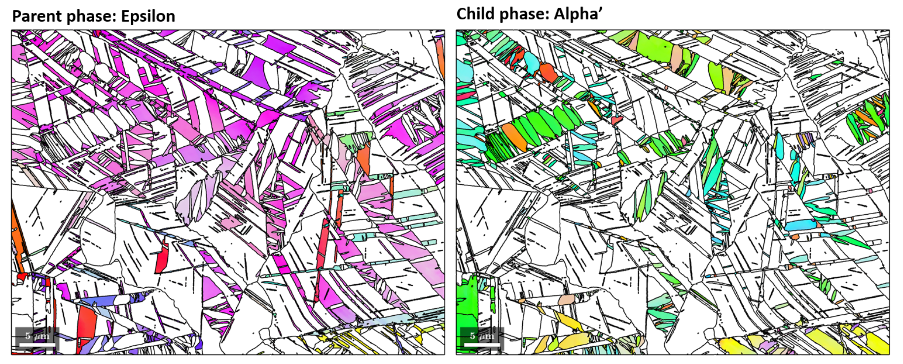
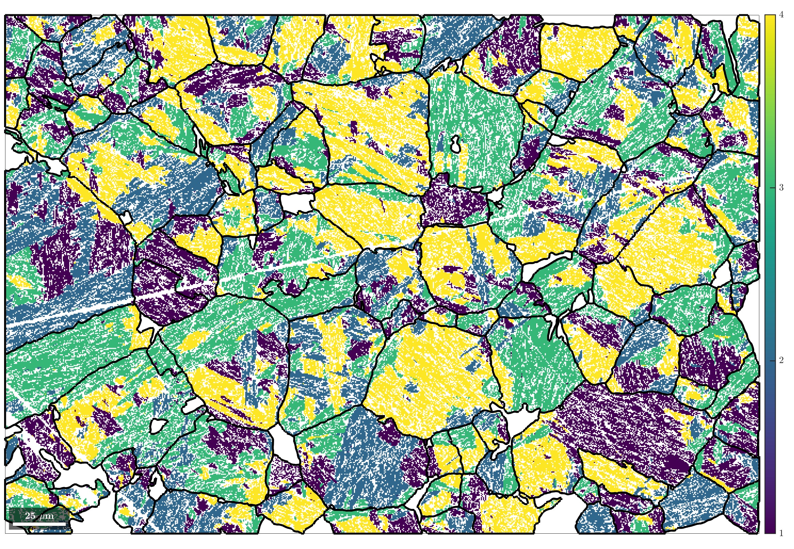
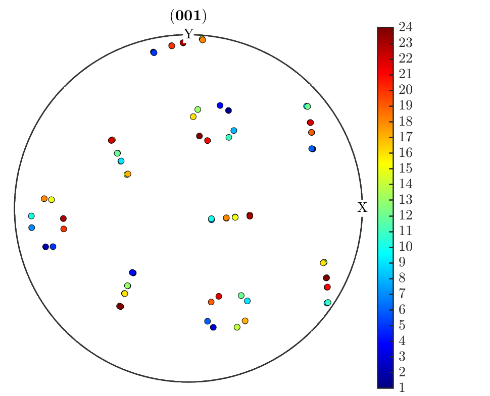

# ORPlotter
**ORPlotter** is a function library for advanced orientation relationship analysis and the plotting of publication-ready figures when working on martensite transformation. The function library is written in **MATLAB** and can be used as an add-on to the basic phase-transition functionalities within the crystallographic [**MATLAB**](https://mathworks.com/products/matlab.html) toolbox [**MTEX**](https://mtex-toolbox.github.io).

MTEX has the functionality to analyse phase-transitions. Its major advantage compared to competing programs is its versatility, both in terms of functionality and data compatibility. The **ORPlotter** library is an add-on to MTEX for advanced OR discovery and analysis and for creating visually stunning and informative plots particular to martensitic microstructures. Due to their specific nature, the codes contained in this library have not been included in the main MTEX program. 

While the **ORPlotter** library mostly consists of plotting functionalities, it also includes utilities that enable advanced OR analysis. These are highlighted together with the plotting functions in a series of [example scripts](https://github.com/frankNiessen/ORPlotter#example-scripts) to showcase how the functions work and what their output comprises.

ORPlotter has been created by *Dr Azdiar Gazder* and *Dr Frank Niessen*. Please report any bugs that you encounter to us so that we can keep this library maintained.

---
## How to use
- The library can be downloaded as a *zip* file and unpacked into the directory of your choice.
- This library only works with an installation of **MATLAB** and **MTEX**. Follow the instructions for installation [here](https://se.mathworks.com/help/install/install-products.html) and [here](https://mtex-toolbox.github.io/download).
- Open MATLAB, navigate to the *ORPlotter* folder and run one of the example files. If you don't want to run examples but want to use the function library, make sure to add the directory with its subdirectories to the MATLAB path.
- If you encounter problems, feel free to contact us.

---

##  Example scripts
The world of martensitic transformation analysis can be difficult to navigate, which is why the **ORPlotter** library consists of plug-and-play functions to make life easier. To make things even more accessible, some example scripts are provided to demonstrate these functions *in action*.

It is possible to run the example scripts from start to end, but we encourage to run the example scripts [in sections](https://mathworks.com/help/matlab/matlab_prog/run-sections-of-programs.html) to understand the relation between code and results. This will also help you to follow the comments, which give instructions on which choices to make in the interactive parts of the program and narrate the obtained plots and results. 

### [Example 1](./ORPlotter_example1.m)
#### Parent grain reconstruction and variant analysis in lath martensitic steel
This script follows the same dataset and steps that are used to demonstrate  the reconstruction of beta parent grains from alpha grains in the official [MTEX example](https://mtex-toolbox.github.io/MaParentGrainReconstruction.html) for phase transitions in steels. Here some of ORplotter's plotting functions are used to create publication-ready plots.

### [Example 2](./ORPlotter_example2.m)
#### Parent grain reconstruction and variant analysis in titanium alloys
This script follows the same dataset and steps that are used to demonstrate the reconstruction of austenitic parent grains from martensite grains in the official [MTEX example](https://mtex-toolbox.github.io/TiBetaReconstruction.html) for phase transitions in titanium alloys. Here ORplotter's misorientation peak-fitter is used to determine the orientation relationship from alpha-beta boundaries, which only make up < 1% of all boundaries in the dataset. Advanced plotting functions are employed to produce publication-ready plots.

### [Example 3](./ORPlotter_example3.m)
#### Using the OR peak fitter to deconvolute multiple OR's in titanium alloys
Following example 2 you may have noted that the alpha-beta Ti microstructure showed two orientation relationships in the OR peak-fitter. In this example we want to return both ORs and investigate which one of them is the dominating one. We do this by plotting the disorientation between grain boundary misorientations and the OR misorientations in inverse polefigure and on boundary maps.

### [Example 4](./ORPlotter_example4.m)
#### Analysing transformation texture
To be added tomorrow...

### [Example 5](./ORPlotter_example5.m)
#### Using the OR peak fitter to clean misindexed data
Here we look into a 20% cold rolled twinning and transformation induced plasticity (TRWIP) steel microstructure in which Epsilon martensite formed from Gamma austenite, and Alpha martensite formed from Epsilon martensite. This is a two-step martensitic transformation. Using the OR peak fitter, we discover that two possible ORs could be in operation. We identify that the first of them is actually not a real OR, but corresponds to points that were misindexed as Alpha even though they belong to Gamma. We use the parent phase reconstruction features in MTEX to revert these misindexed points. We then reiterate the grain calculation and run the OR peak fitter again to show that this apparent OR has been eliminated. This example is a template of how to reconstruct parent phase microstructures based on multiple orientation relationships in one microstructure. 

*EBSD map courtesy: Pramanik et al. https://doi.org/10.1016/j.msea.2018.06.024*

---

##  Function reference

### Function Index

- [computeGrains](https://github.com/frankNiessen/ORPlotter/blob/master/README.md#computeGrains)
- [defineORs](https://github.com/frankNiessen/ORPlotter/blob/master/README.md#defineors)
- [fibreMaker](https://github.com/frankNiessen/ORPlotter/blob/master/README.md#fibreMaker)
- [guiOR](https://github.com/frankNiessen/ORPlotter/blob/master/README.md#guiOR)
- [orientationMaker](https://github.com/frankNiessen/ORPlotter/blob/master/README.md#orientationMaker)
- [ORinfo](https://github.com/frankNiessen/ORPlotter/blob/master/README.md#ORinfo)
- [peakFitORs](https://github.com/frankNiessen/ORPlotter/blob/master/README.md#peakFitORs)
- [plotIPDF_gB_Misfit](https://github.com/frankNiessen/ORPlotter/blob/master/README.md#peakFitORs)
- [plotIPDF_gB_Prob](https://github.com/frankNiessen/ORPlotter/blob/master/README.md#plotIPDF_gB_Prob)
- [plotMap_gB_c2c](https://github.com/frankNiessen/ORPlotter/blob/master/README.md#plotMap_gB_c2c)
- [plotMap_gB_Misfit](https://github.com/frankNiessen/ORPlotter/blob/master/README.md#plotMap_gB_Misfit)
- [plotMap_gB_p2c](https://github.com/frankNiessen/ORPlotter/blob/master/README.md#plotMap_gB_p2c)
- [plotMap_gB_Prob](https://github.com/frankNiessen/ORPlotter/blob/master/README.md#plotMap_gB_Prob)
- [plotMap_IPF_p2c](https://github.com/frankNiessen/ORPlotter/blob/master/README.md#plotMap_IPF_p2c)
- [plotMap_packets](https://github.com/frankNiessen/ORPlotter/blob/master/README.md#plotMap_packets)
- [plotMap_phases](https://github.com/frankNiessen/ORPlotter/blob/master/README.md#plotMap_phases)
- [plotMap_variants](https://github.com/frankNiessen/ORPlotter/blob/master/README.md#plotMap_variants)
- [plotPDF_variants](https://github.com/frankNiessen/ORPlotter/blob/master/README.md#plotPDF_variants)
- [plotPODF_transformation](https://github.com/frankNiessen/ORPlotter/blob/master/README.md#plotPODF_transformation)
- [readCPR](https://github.com/frankNiessen/ORPlotter/blob/master/README.md#readCPR)
- [recolorPhases](https://github.com/frankNiessen/ORPlotter/blob/master/README.md#recolorPhases)
- [renamePhases](https://github.com/frankNiessen/ORPlotter/blob/master/README.md#renamePhases)
- [screenPrint](https://github.com/frankNiessen/ORPlotter/blob/master/README.md#screenPrint)
- [setParentGrainReconstructor](https://github.com/frankNiessen/ORPlotter/blob/master/README.md#setParentGrainReconstructor)

### [computeGrains](./src/computeGrains.m)
Small GUI to compute grains from EBSD data and optionally filter them.

- Syntax
  - [ebsd,grains,gB] = computeGrains(ebsd)
- Input
  - ebsd  - @EBSD
- Output
  - ebsd     - @EBSD
  - grains   - @grains2d 
  - gB       - @grainBoundary

  

### [defineORs](./src/defineORs.m)
Auxiliary function to define orientation relationships for a parent and child phase given in *job* by either parallel planes and directions in a GUI or peakfitting of the parent-child boundary misorientation angle distribution

- Syntax
  - job = defineORs(job)
- Input
  - job  - @parentGrainReconstructor
- Output
  - job  - @parentGrainReconstructor

### [fibreMaker](./src/fibreMaker.m)
The function creates a VPSC file with orientations following the distribution of a fibre ODF

- Syntax
  -  fibreMaker(crystalDirection,specimenDirection)
- Input
  - crystalDirection  - @Miller
  - specimenDirection - @vector3d
- Options
  - halfwidth   - Halfwidth for ODF calculation
  - nrPoints    - Nr of points in the VPSC file

### [guiOR](./src/guiOR.m)
Graphical user interface for definition of an orientation relationship by parallel planes and directions

- Syntax
  - p2c = guiOR(job)
- Input
  - job  - @parentGrainReconstructor
- Output
  - p2c  - parent to child misorientation

  

### [orientationMaker](./src/orientationMaker.m)
The function creates a VPSC file with orientations following the distribution of a unimodal ODF

- Syntax
  -  orientationMaker(ori)
- Input
  - ori   - @orientation
- Options
  - halfwidth   - Halfwidth for ODF calculation
  - nrPoints    - Nr of points in the VPSC file

### [ORinfo](./src/ORinfo.m)
The function outputs information about the orientation relationship in the command window and returns a structure containing the information.

- Syntax
  -  ORinfo(p2c)
- Input
  - p2c       - parent to child misorientation
- Output
  - OR        - structure containing OR information
- Options
  - silent    - suppress command window output

  

### [peakFitORs](./src/peakFitORs.m)
The function peak fits parent-child misorientation angle ranges for determination of one or several orientation relationships.
The function is called by [defineORs](https://github.com/frankNiessen/ORPlotter/blob/master/README.md#defineors).

- Syntax
  -  p2c = peakFitORs(job,misoRange)
- Input
  - job         - @parentGrainReconstructor
  - misoRange   - range of misorientation angles in which to fit
- Output
  - p2c       - parent to child misorientation

  

### [plotIPDF_gB_Misfit](./src/plotIPDF_gB_Misfit.m)
This function plots the misfit, or the disorientation, between the parent-child and child-child boundaries with the orientation relationship in an inverse polefigure showing the misorientation axes

- Syntax
  -  plotIPDF_gB_Misfit(job)
- Input
  - job  - @parentGrainReconstructor
- Options
  - colormap  - colormap string  

  

### [plotIPDF_gB_Prob](./src/plotIPDF_gB_Prob.m)
This function calculates and plots the probability distribution between 0 and 1, that a boundary belongs to the orientation relationship in an inverse polefigure showing the misorientation axes

- Syntax
  -  plotIPDF_gB_Prob(job)
- Input
  - job  - @parentGrainReconstructor
- Options
  - colormap  - colormap string  

  

### [plotMap_gB_c2c](./src/plotMap_gB_c2c.m)
The function colorizes the child-child boundaries in *job*

- Syntax
  -  plotMap_gB_c2c(job)
- Input
  - job  - @parentGrainReconstructor
- Options
  - colormap  - colormap string 

  

### [plotMap_gB_Misfit](./src/plotMap_gB_Misfit.m)
The function colorizes the misfit, or the disorientation, between the parent-child and child-child boundaries with the orientation relationship *job.p2c*

- Syntax
  - plotMap_gB_Misfit(job)
- Input
  - job  - @parentGrainReconstructor
- Options
  - colormap  - colormap string 

  

### [plotMap_gB_p2c](./src/plotMap_gB_p2c.m)
The function colorizes the parent-child boundaries in *job* according to their misorientation angle.

- Syntax
  -  plotMap_gB_p2c(job)
- Input
  - job  - @parentGrainReconstructor
- Options
  - colormap  - colormap string 
 

  

### [plotMap_gB_Prob](./src/plotMap_gB_Prob.m)
The function calculates and plots the probability distribution between 0 and 1, that a 
boundary belongs to the orientation relationship (see more [here](https://mtex-toolbox.github.io/parentGrainReconstructor.calcGraph.html))

- Syntax
  -  plotMap_gB_Prob(job)
- Input
  - job  - @parentGrainReconstructor
- Options
  - threshold - the misfit at which the probability is exactly 50 percent ... 
  - tolerance - ... and the standard deviation in a cumulative Gaussian distribution
  - colormap  - colormap string 
 

  

### [plotMap_IPF_p2c](./src/plotMap_IPF_p2c.m)
The function plots the inverse polefigure maps of the parent and child phases and returns the ipfHSV color key.

- Syntax
  -  plotMap_IPF_p2c(job)
  -  plotMap_IPF_p2c(job, direction)
- Input
  - job       - @parentGrainReconstructor
  - direction - @vector3d 
- Output
  - ipfKey - @ipfHSVKey 

  

### [plotMap_packets](./src/plotMap_packets.m)
The function plots the map of child grains colored according to their packet ID.

- Syntax
  -  plotMap_packets(job)
- Input
  - job  - @parentGrainReconstructor
- Output
  - colormap - colormap string

  

### [plotMap_phases](./src/plotMap_phases.m)
The function plots a phase map of the grains within *job* and the grain boundaries (*job.grains.boundary*).

- Syntax
  -  p2c = plotMap_phases(job)
- Input
  - job  - @parentGrainReconstructor

  

### [plotMap_variants](./src/plotMap_variants.m)
The function plots the map of child grains colored according to their variant ID.

- Syntax
  -  plotMap_variants(job)
- Input
  - job  - @parentGrainReconstructor
- Output
  - colormap - colormap string

  

### [plotPDF_variants](./src/plotPDF_variants.m)
The function plots a pole figure of the martensitic variants associated with the OR *job.p2c*. It is an alternative to MTEX's [plotVariantPF](https://mtex-toolbox.github.io/parentGrainReconstructor.plotVariantPF.html).

- Syntax
  -  plotPDF_variants(job)
  -  plotPDF_variants(job, oriParent)
  -  plotPDF_variants(job, oriParent, pdf)
- Input
  - job       - @parentGrainReconstructor
  - oriParent - @orientation
  - pdf       - @Miller
- Options
  - colormap  - colormap string 

  

### [plotPODF_transformation](./src/plotPODF_transformation.m)
The function calculates and plots the transformation texture, with or without imposing variant selection, based on a parent texture in inputVPSC.Tex, created with [fibreMaker](https://github.com/frankNiessen/ORPlotter/blob/master/README.md#fibreMaker) or [orientationMaker](https://github.com/frankNiessen/ORPlotter/blob/master/README.md#orientationMaker)

- Syntax
  -  plotPODF_transformation(job,hParent,hChild)
- Input
  - hParent     - @Miller  (parent polefigures to plot)
  - hChild      - @Miller  (child polefigures to plot)
- Options
  - odfSecP      - array with angles of parent ODF section to display
  - odfSecC      - array with angles of child ODF section to display
  - variantId    - list with specific variant Ids to plot
  - halfwidth    - halfwidth for ODF calculation
  - nrPoints     - nr of points to be written into the VPSC file
  - colormap     - colormap string

  

### [readCPR](./src/readCPR.m)
This is a short auxiliary function to read in *.cpr/.crc* files with a browser window.

- Syntax
  - ebsd = readCPR
  - ebsd = readCPR(inPath)
  - ebsd = readCPR(inPath, fileName)
- Input
  - inPath   - string with path to directory 'xx\yy\zz\'
  - fileName - string with filename 'xxyyzz.cpr'
- Output
  - ebsd             - @EBSD

### [recolorPhases](./src/recolorPhases.m)
The function opens an interactive colorpicker tool to redefine the phase colors in the *grains* and *ebsd* variables.

- Syntax
  - [ebsd,grains] = recolorPhases(ebsd,grains)
- Input
  - ebsd             - @EBSD
  - grains           - @grain2d
- Output
  - ebsd             - @EBSD
  - grains           - @grain2d
  

  

### [renamePhases](./src/renamePhases.m)
The function opens an interactive list with the possible phasenames in *phaseStrings* and renames the phases in *ebsd* according to the selection.

- Syntax
  - ebsd = renamePhases(ebsd,phStr)
- Input
  - ebsd             - @EBSD
  - phaseStrings     - cell array of strings with possible phase names
- Output
  - ebsd             - @EBSD

### [screenPrint](./src/screenPrint.m)
Auxiliary function for formating command window output

- Syntax
  - screenPrint(mode)
  - screenPrint(mode, string)
- Input
  - mode     - Formatting mode
  - string   - Output string

### [setParentGrainReconstructor](./src/setParentGrainReconstructor.m)
Auxiliary GUI function to define a job of class [parentGrainReconstructor](https://mtex-toolbox.github.io/parentGrainReconstructor.parentGrainReconstructor.html)

- Syntax
  - setParentGrainReconstructor(ebsd,grains)
  - setParentGrainReconstructor(ebsd,grains,inPath)
- Input
  - ebsd     - @EBSD
  - grains   - @grain2d
  - inPath   - string giving path to cif-file folder 
- Output
  - job      - @parentGrainReconstructor
