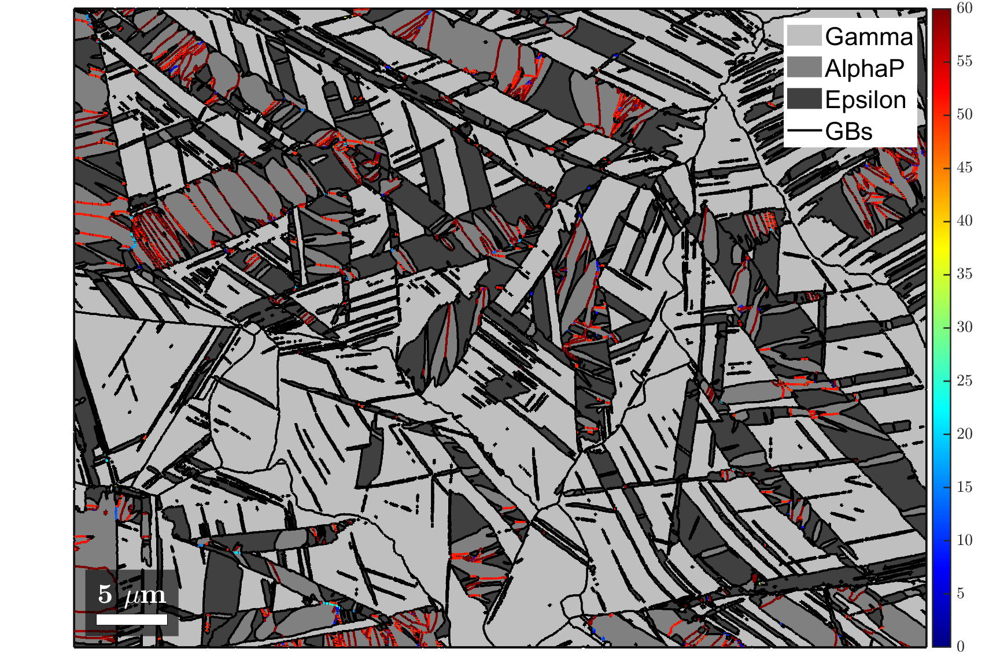

# ***** REPO CURRENTLY UNDER CONSTRUCTION *****

# ORPlotter
**ORPlotter** is a function library for plotting publication-ready figures on analysis of martensitic transformations. The function library is written in **MATLAB** and can be used as an add-on to the basic phase-transition functionalities within the crystallographic **MATLAB** toolbox **MTEX** (found [here](https://mtex-toolbox.github.io/MaParentGrainReconstruction.html)).

MTEX has a vast functionality to analyse phase-transitions. It's major advantage compared to competing programs is its versatility, both in therms of functionality and data compatibility. The current library aims at being an add-on to MTEX for creating stunning and informative plots on martensitic microstructures that are too individual to be included in the main MTEX program. 

While the library mostly consists of plotting functionalities, it also includes some utility functions and advanced analysis capabilities. These are highlighted in an example script **"TBA"** that follows the analysis shown in the [MTEX documentation](https://mtex-toolbox.github.io/MaParentGrainReconstruction.html) and extends it by using the present library.

---

##  Example scripts
We know that the world of martensitic transformation analysis can be difficult to navigate, which is why we made this library of plug-and-play functions. To make things even more accessible, we have written some example scripts to demonstrate these functions *in action*.

### [Example 1](./scripts/ORPlotter_example1.m)
This script follows the same dataset and steps that are used to demonstrate the reconstruction of austenitic parent grains from martensite grains in the official [MTEX example](https://mtex-toolbox.github.io/MaParentGrainReconstruction.html) for phase transitions in steels. Here we introduce some of ORplotter's functionalities to demonstrate which functions can be used in which steps of the process to generate publication-ready plots.

---

##  Function reference
All functions should be well-documented by comments within the functions and are most easily accessible by running through the [example scripts](./scripts). Here is a brief overview of all functions contained in *ORPlotter*:

### [ORinfo](./src/ORinfo.m)
- Syntax
  -  ORinfo(p2c)
- Input
  - p2c       - parent to child misorientation
- Output
  - OR        - structure containing OR information
- Options
  - silent    - suppress command window output

The function outputs information about the orientation relationship in the command window and returns a structure containing the information.

  

### [plotMap_gB_c2c](./src/plotMap_gB_c2c.m)
- Syntax
  -  plotMap_gB_c2c(job)
- Input
  - job  - @parentGrainReconstructor

The function colorizes the child-to-child grain boundaries in *job* according to their misorientation angle on top of a greyscale phase map.

  

### [plotMap_gB_p2c](./src/plotMap_gB_p2c.m)
- Syntax
  -  plotMap_gB_p2c(job)
- Input
  - job  - @parentGrainReconstructor

The function colorizes the parent-to-child grain boundaries in *job* according to their misorientation angle on top of a greyscale phase map.

  

### [plotMap_IPF_p2c](./src/plotMap_IPF_p2c.m)
- Syntax
  -  plotMap_IPF_p2c(job)
  -  plotMap_IPF_p2c(job, direction)
- Input
  - job  - @parentGrainReconstructor
- Output
  - ipfKey - @ipfHSVKey 

The function plots the inverse polefigure maps of the parent and child phases and returns the ipfHSV color key.

  

### [plotMap_phases](./src/plotMap_phases.m)
- Syntax
  -  p2c = plotMap_phases(job)
- Input
  - job  - @parentGrainReconstructor

The function plots a phase map of the grains within "job" and adds the high-angle boundaries (*job.grains.boundary*) and low-angle boundaries (*jobgrains.innerBoundary*).

  

### [recolorPhases](./src/recolorPhases.m)
- Syntax
  - [ebsd,grains] = recolorPhases(ebsd,grains)
- Input
  - ebsd             - @EBSD
  - grains           - @grain2d
- Output
  - ebsd             - @EBSD
  - grains           - @grain2d
 
The function opens an interactive colorpicker tool to redefine the phase colors in the *grains* and *ebsd* variables.

### [renamePhases](./src/renamePhases.m)
- Syntax
  - ebsd = renamePhases(ebsd,phStr)
- Input
  - ebsd             - @EBSD
  - phaseStrings     - cell array of strings with possible phase names
- Output
  - ebsd             - @EBSD
 
The function opens an interactive list with the possible phasenames in *phaseStrings* and renames the phases in *ebsd* according to the selection.

