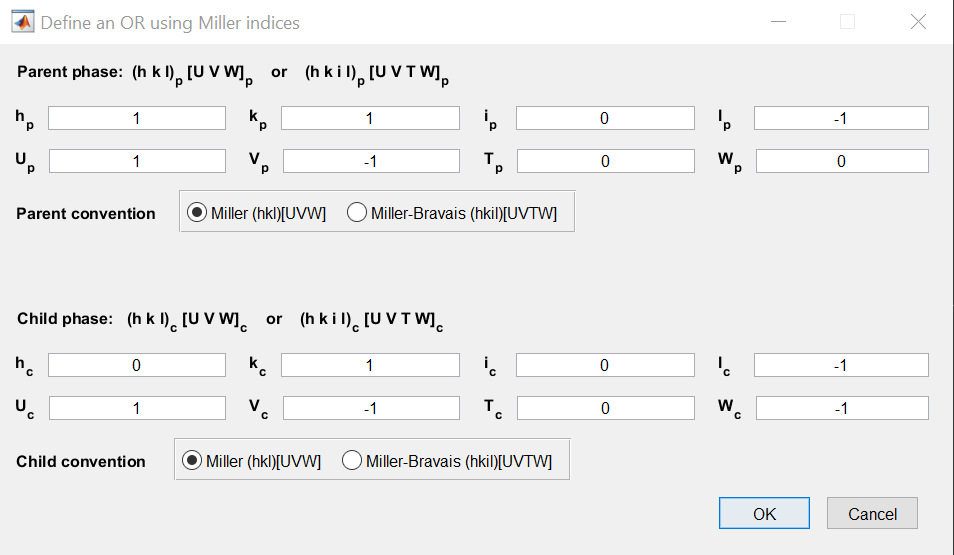
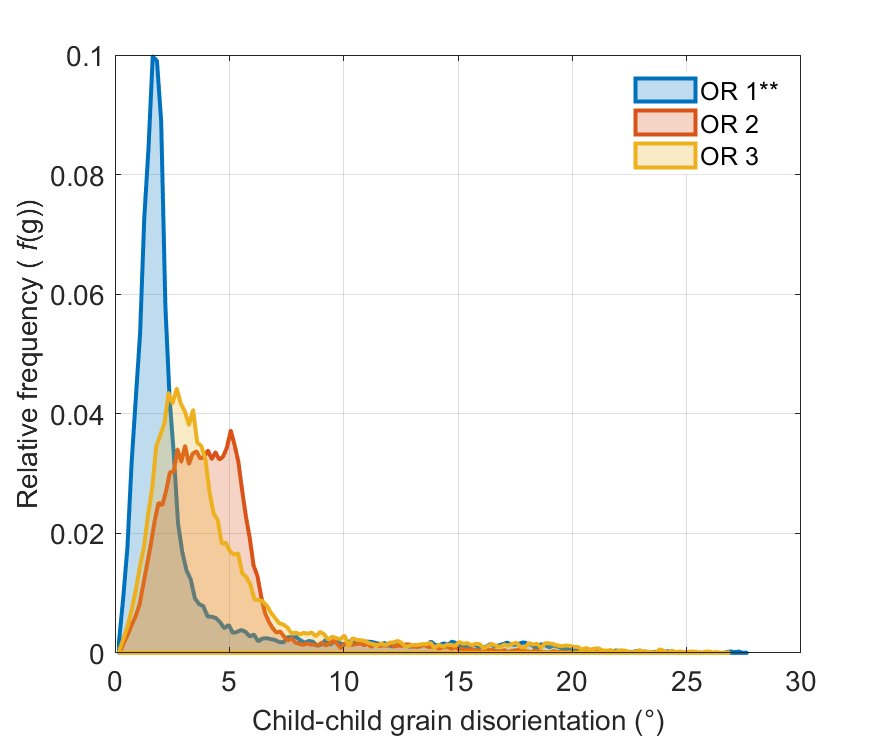
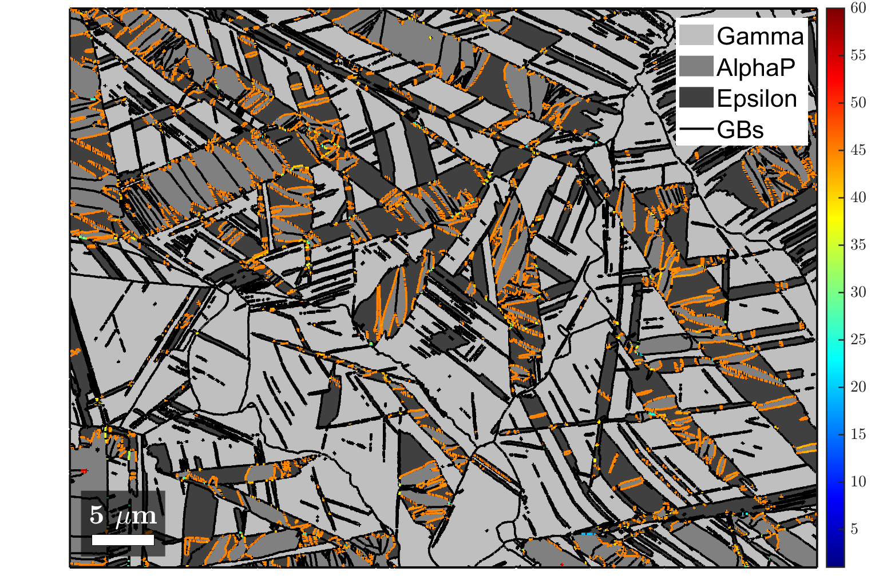
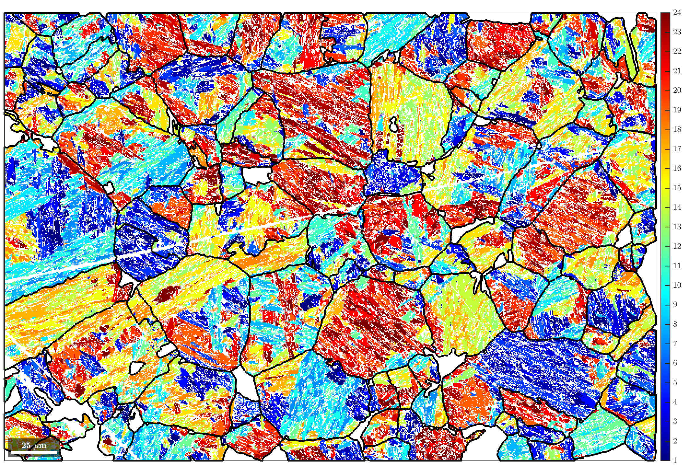
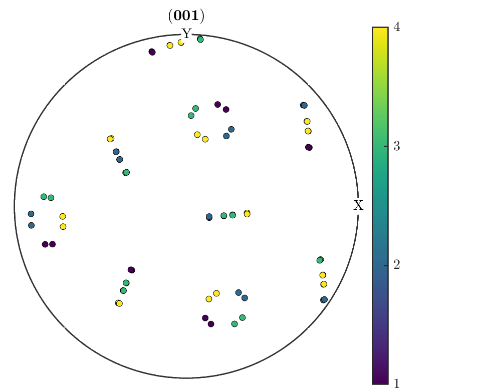

## UPDATE
**For MTEX Version 5.9.0 (released in Mar 2023):**
- Fixes for known bugs have been implemented in the **[ORTools Developer](https://github.com/ORTools4MTEX/ORTools)** branch.
- In case of any new bugs/issues, please report them in the **[ORTools Discussions](https://github.com/ORTools4MTEX/ORTools/discussions)** section.
- A newer stable version, **ORTools v2.1.0**, will be released shortly.

**For MTEX Version 5.8.2 (released in Nov 2022):**
- All scripts in **[ORTools v2.0.2](https://github.com/ORTools4MTEX/ORTools/releases/tag/v2.0.2)** are fully functional.

---

  

---

| [**• Introduction to ORTools**](https://github.com/ORTools4MTEX/ORTools#introduction-to-ortools) |
| :--- |

| [**• Authors**](https://github.com/ORTools4MTEX/ORTools#authors) | [**• Contributors**](https://github.com/ORTools4MTEX/ORTools#contributors) |
| :--- | :--- |

| [**• How to cite ORTools**](https://github.com/ORTools4MTEX/ORTools#how-to-cite-ortools) | [**• How to use ORTools**](https://github.com/ORTools4MTEX/ORTools#how-to-use-ortools) |
| :--- | :--- |

| [**• ORTools example scripts**](https://github.com/ORTools4MTEX/ORTools#ortools-example-scripts) | [**• ORTools function reference**](https://github.com/ORTools4MTEX/ORTools#ortools-function-reference) |
| :--- | :--- |
---

## Introduction to ORTools
**Orientation relationship tools** (**ORTools**) is a function library for OR discovery, advanced OR analysis and the plotting of visually stunning and informative publication-ready figures particular to microstructures undergone partial/full martensitic transformation or OR-related phase transition. 

The **ORTools** function library is written in [**MATLAB**](https://mathworks.com/products/matlab.html) and is used as an add-on to the basic phase transformation functionalities within the MATLAB-based crystallographic toolbox [**MTEX**](https://mtex-toolbox.github.io). Due to their specific nature, the scripts contained in the **ORTools** library have not been included in MTEX. You may want to watch this [talk by Frank Niessen](https://youtu.be/B0faPjtOdmA) at the 2021 MTEX Workshop for an introduction to the phase transformation features in MTEX and **ORTools**. 

The advanced OR discovery, analysis and plotting functionalities of the **ORTools** library are highlighted in a series of [example scripts](https://github.com/ORTools4MTEX/ORTools#example-scripts) that showcase how the functions work and what their output comprises. 

To help maintain the **ORTools** library, please report any bugs you encounter in the [discussions board](https://github.com/ORTools4MTEX/ORTools/discussions). If you would like to contribute additional functionalities or wish to suggest new features that help improve it, please contact us.

[*A short introduction to ORTools*](https://youtu.be/inkR6LBzFeQ)

---

## Authors
**ORTools** has been created by [**Dr Azdiar Gazder**](https://www.researchgate.net/profile/Azdiar-Gazder) and [**Dr Frank Niessen**](https://www.researchgate.net/profile/Frank-Niessen-4). 

---

## Contributors
[**Dr Tuomo Nyyssönen**](https://www.researchgate.net/profile/Tuomo-Nyyssoenen) - Lath martensite block width calculator

---

## How to cite ORTools
If you have applied the OR discovery, OR and variant analyses, parent grain reconstruction, and correlated plotting features of MTEX and **ORTools** to your research, please cite this open-access paper as your reference:

[**F. Niessen, T. Nyyssönen, A.A. Gazder, R. Hielscher, Parent grain reconstruction from partially and fully transformed microstructures in MTEX, Journal of Applied Crystallography: 55(1), pp. 180-194, 2022. (https://doi.org/10.1107/S1600576721011560)**](https://journals.iucr.org/j/issues/2022/01/00/nb5309/nb5309.pdf)

---

## How to use ORTools
- Download the [**LATEST STABLE RELEASE**](https://github.com/ORTools4MTEX/ORTools/releases) or the [**DEVELOPER VERSION**](https://github.com/ORTools4MTEX/ORTools/archive/develop.zip) of **ORTools** by clicking on either weblink.
- This library only works after the prior installation of [MATLAB](https://se.mathworks.com/help/install/install-products.html) and [MTEX](https://mtex-toolbox.github.io/download). Follow the instructions for installing [MATLAB](https://se.mathworks.com/help/install/install-products.html) and [MTEX](https://mtex-toolbox.github.io/download) by clicking on these weblinks and/or refer to the video given below. ORTools is tested for compatibility from MATLAB 2016b onwards. With each [release](https://github.com/ORTools4MTEX/ORTools/releases) of ORTools, please check which version of MTEX it is compatible with. 
- The peak fitting functionality within the function [defineORs](https://github.com/ORTools4MTEX/ORTools/blob/master/README.md#defineors) requires the prior installation of the [MATLAB Signal Processing Toolbox](https://au.mathworks.com/products/signal.html).
- Open MATLAB and run one of the example files. Please refer to the [Example 1](https://youtu.be/AcR-nXg5QKo) instruction video to learn how to run the examples. Alternatively, if you do not wish to run the example files and want to use the function library instead, please ensure that the **ORTools** root directory and all of its sub-directories are added to the MATLAB path. 
- If you encounter any problems, please [submit an issue](https://github.com/ORTools4MTEX/ORTools/issues).
- If you would like to contribute additional functionalities or wish to suggest new features, please [submit a contribution or request for a feature](https://github.com/ORTools4MTEX/ORTools/issues).

[*How to install MTEX*](https://youtu.be/SsiDFqqqZU4)

---

##  ORTools example scripts
The world of martensitic transformation or phase transition analysis can be difficult to navigate. To help make the analysis accessible, transparent, and easy to comprehend, the **ORTools** library consists of plug-and-play functions. Example scripts are provided to help demonstrate these functions *in action*.

It is possible to run the example scripts from start to end, but we encourage you to run the example scripts [in sections](https://mathworks.com/help/matlab/matlab_prog/run-sections-of-programs.html) to understand the correlation between the scripts and the generated results. 
This will also help you follow the comments, which provide instructions on the various choices to make in the interactive parts of the program and/or help explain the obtained plots and results. In this way, you will learn the syntax applied throughout the scripts as well as the meaning behind the presented results.

---

### [Example 8: 29 MAR 2023](./ORTools_example8.m)
#### Update to Example 2: Parent grain reconstruction using the variant graph approach in Ti alloys
This script follows the same dataset as that used in the official [MTEX example](https://mtex-toolbox.github.io/TiBetaReconstruction.html) to demonstrate the reconstruction of parent beta grains from child alpha grains in a alpha-beta Ti alloy.
The script provides a faster and less involved way of reconstructing this microstructure compared to the
tripple-point based approach from [Example 2](./ORTools_example2.m). 

The details related to the variant graph approach are described in the following paper:

[**R. Hielscher, T. Nyyssönen, F. Niessen, A.A. Gazder, The variant graph approach to improved parent grain reconstruction, Materialia: 22, 101399, 2022. (https://doi.org/10.1016/j.mtla.2022.101399)**](https://www.researchgate.net/publication/357646342_The_variant_graph_approach_to_improved_parent_grain_reconstruction)

---

### [Example 7: 23 MAR 2022](./ORTools_example7.m)
#### Update to Example 1: Parent grain reconstruction using the new variant graph approach and advanced variant analysis in lath martensitic steel
This script follows the same dataset as that used in the official [MTEX example](https://mtex-toolbox.github.io/MaParentGrainReconstruction.html) to demonstrate the reconstruction of parent austenite grains from child lath martensite using the new **variant graph approach**. Compared to the original [Example 1](./ORTools_example1.m), this updated version also features equivalent variant pair analysis and the measurement of lath block widths. 

The details related to the variant graph approach are described in the following paper:

[**R. Hielscher, T. Nyyssönen, F. Niessen, A.A. Gazder, The variant graph approach to improved parent grain reconstruction, Materialia: 22, 101399, 2022. (https://doi.org/10.1016/j.mtla.2022.101399)**](https://www.researchgate.net/publication/357646342_The_variant_graph_approach_to_improved_parent_grain_reconstruction)

[*Example 7 - Variant graph approach & advanced variant analysis in lath martensitic steel*](https://youtu.be/E9IFyFUQNl4)

---

### [Example 6: 12 MAY 2021](./ORTools_example6.m)
#### Two-stage parent grain reconstruction in a TWIP-TRIP steel
This example is of a 10% cold-rolled twinning and transformation induced plasticity (TWIP-TRIP) steel microstructure with a two-step martensitic transformation in which ε martensite formed from γ austenite, and α' martensite formed from ε martensite. ORTools and the MTEX parent grain reconstruction functionalities are used to reconstruct both parent microstructures in a single workflow. Towards the end, it is demonstrated that variant analysis can be conducted on both transformations. 

*EBSD map courtesy: Pramanik et al. https://doi.org/10.1016/j.msea.2018.06.024*

[*Example 6 - Two-stage parent grain reconstruction in a TWIP-TRIP steel*](https://youtu.be/K2rO3Mx4A8s)

---

### [Example 5: 4 MAR 2021](./ORTools_example5.m)
#### Partial parent grain reconstruction to clean TWIP-TRIP steel EBSD data
This example is of a 20% cold-rolled twinning and transformation induced plasticity (TWIP-TRIP) steel microstructure presenting with a two-step martensitic transformation in which ε martensite formed from γ austenite, and α' martensite formed from ε martensite. Using the [OR peak fitter](https://github.com/ORTools4MTEX/ORTools/blob/master/README.md#peakFitORs) function, it is discovered that two possible ORs could be in operation for the γ to α' microstructure. The first OR is identified as not a real OR but rather, an "apparent" OR corresponding to pixels that were misindexed as α' during map acquisition even though they notionally belong to γ. The parent phase reconstruction features in MTEX and the "apparent" OR are used to revert these misindexed points to γ. The grain calculation and the OR peak fitter is re-run to show that the "apparent" OR was eliminated. 

*EBSD map courtesy: Pramanik et al. https://doi.org/10.1016/j.msea.2018.06.024*

[*Example 5 - Partial parent grain reconstruction to clean TRIP-TWIP steel EBSD map data*](https://youtu.be/Hj5kVscjljU)

---

### [Example 4: 4 MAR 2021](./ORTools_example4.m)
#### Predicting the β to α transformation texture in a titanium alloy
In this script, the reconstruction of the prior parent β microstructure from a child α microstructure is repeated as shown in [example 2](https://github.com/ORTools4MTEX/ORTools#example-2). Examination of the variant distribution shows that strongly preferential variant selection did not occur. Therefore, the transition texture of α can be accurately predicted from the reconstructed β using the [plotPODF_transform](https://github.com/ORTools4MTEX/ORTools/blob/master/README.md#plotPODF_transform) function. The result shows that the predicted α transition texture is in good agreement with the experimental α texture.

[*Example 4 - Transformation texture prediction in titanium alloys*](https://youtu.be/Yx2jKII3HUc)

---

### [Example 3: 4 MAR 2021](./ORTools_example3.m)
#### Using the OR peak fitter to deconvolute multiple ORs in titanium alloys
In [example 2](https://github.com/ORTools4MTEX/ORTools#example-2) the α-β Ti microstructure showed two ORs in the [OR peak fitter](https://github.com/ORTools4MTEX/ORTools/blob/master/README.md#peakFitORs) function. In this example, both ORs are investigated to find out which one of them dominated the phase transition. To evaluate the best match, the disorientation between grain boundary misorientations and the OR misorientations in inverse pole figures and on boundary maps are plotted.

[*Example 3 - Separation of multiple ORs in titanium alloys*](https://youtu.be/8e9PhhFCWYc)

---

### [Example 2: 3 MAR 2021](./ORTools_example2.m)
#### Parent grain reconstruction and variant analysis in titanium alloys
This script follows the same dataset and steps that are used to demonstrate the reconstruction of β grains from an α microstructure in the official [MTEX example](https://mtex-toolbox.github.io/TiBetaReconstruction.html) for phase transitions in titanium alloys. Here the [OR peak fitter](https://github.com/ORTools4MTEX/ORTools/blob/master/README.md#peakFitORs) function is used to determine the OR from alpha-beta boundaries even though they only make up < 1% of all boundaries in the dataset. Advanced plotting functions are employed to produce publication-ready plots.

[*Example 2 - Parent grain reconstruction in titanium alloys*](https://youtu.be/e6R0dApUc8Q)

---

### [Example 1: 3 MAR 2021](./ORTools_example1.m)
#### Parent grain reconstruction and variant analysis in lath martensitic steel
This script follows the same dataset and steps that are used to demonstrate the reconstruction of austenitic parent grains from martensite grains using the **grain graph approach** in the official [MTEX example](https://mtex-toolbox.github.io/GrainGraphBasedReconstruction.html) for martensite transformation in steels. The functionality of **ORTools** in providing pre-written and additional plotting functions to create publication-ready plots is demonstrated.

[*Example 1 - Parent grain reconstruction in steel*](https://youtu.be/AcR-nXg5QKo)

---

## ORTools alphabetical function index

### C
- [computeBainGrains](https://github.com/ORTools4MTEX/ORTools/blob/master/README.md#computeBainGrains)
- [computeGrains](https://github.com/ORTools4MTEX/ORTools/blob/master/README.md#computeGrains)
- [computeHabitPlane](https://github.com/ORTools4MTEX/ORTools/blob/master/README.md#computeHabitPlane)
- [computePacketGrains](https://github.com/ORTools4MTEX/ORTools/blob/master/README.md#computePacketGrains)
- [computeParentTwins](https://github.com/ORTools4MTEX/ORTools/blob/master/README.md#computeParentTwins)
- [computeVariantGrains](https://github.com/ORTools4MTEX/ORTools/blob/master/README.md#computeVariantGrains)

### D
- [defineORs](https://github.com/ORTools4MTEX/ORTools/blob/master/README.md#defineors)

### F
- [fibreMaker](https://github.com/ORTools4MTEX/ORTools/blob/master/README.md#fibreMaker)

### G
- [grainClick](https://github.com/ORTools4MTEX/ORTools/blob/master/README.md#grainClick)
- [guiOR](https://github.com/ORTools4MTEX/ORTools/blob/master/README.md#guiOR)

### O
- [orientationMaker](https://github.com/ORTools4MTEX/ORTools/blob/master/README.md#orientationMaker)
- [ORinfo](https://github.com/ORTools4MTEX/ORTools/blob/master/README.md#ORinfo)

### P
- [peakFitORs](https://github.com/ORTools4MTEX/ORTools/blob/master/README.md#peakFitORs)
- [plotHist_OR_misfit](https://github.com/ORTools4MTEX/ORTools/blob/master/README.md#plotHist_OR_misfit)
- [plotIPDF_gB_misfit](https://github.com/ORTools4MTEX/ORTools/blob/master/README.md#plotIPDF_gB_misfit)
- [plotIPDF_gB_prob](https://github.com/ORTools4MTEX/ORTools/blob/master/README.md#plotIPDF_gB_prob)
- [plotMap_bain](https://github.com/ORTools4MTEX/ORTools/blob/develop/README.md#plotmap_bain)
- [plotMap_blockWidths](https://github.com/ORTools4MTEX/ORTools/blob/develop/README.md#plotmap_blockwidths)
- [plotMap_clusters](https://github.com/ORTools4MTEX/ORTools/blob/master/README.md#plotMap_clusters)
- [plotMap_gB_c2c](https://github.com/ORTools4MTEX/ORTools/blob/master/README.md#plotMap_gB_c2c)
- [plotMap_gB_misfit](https://github.com/ORTools4MTEX/ORTools/blob/master/README.md#plotMap_gB_misfit)
- [plotMap_gB_p2c](https://github.com/ORTools4MTEX/ORTools/blob/master/README.md#plotMap_gB_p2c)
- [plotMap_gB_prob](https://github.com/ORTools4MTEX/ORTools/blob/master/README.md#plotMap_gB_prob)
- [plotMap_IPF_p2c](https://github.com/ORTools4MTEX/ORTools/blob/master/README.md#plotMap_IPF_p2c)
- [plotMap_packets](https://github.com/ORTools4MTEX/ORTools/blob/master/README.md#plotMap_packets)
- [plotMap_phases](https://github.com/ORTools4MTEX/ORTools/blob/master/README.md#plotMap_phases)
- [plotMap_variantPairs](https://github.com/ORTools4MTEX/ORTools/blob/develop/README.md#plotmap_variantPairs)
- [plotMap_variants](https://github.com/ORTools4MTEX/ORTools/blob/master/README.md#plotMap_variants)
- [plotPDF_bain](https://github.com/ORTools4MTEX/ORTools/blob/master/README.md#plotPDF_bain)
- [plotPDF_packets](https://github.com/ORTools4MTEX/ORTools/blob/master/README.md#plotPDF_packets)
- [plotPDF_variants](https://github.com/ORTools4MTEX/ORTools/blob/master/README.md#plotPDF_variants)
- [plotPODF_transform](https://github.com/ORTools4MTEX/ORTools/blob/master/README.md#plotPODF_transform)
- [plotStack](https://github.com/ORTools4MTEX/ORTools/blob/master/README.md#plotStack)

### R
- [readCPR](https://github.com/ORTools4MTEX/ORTools/blob/master/README.md#readCPR)
- [recolorPhases](https://github.com/ORTools4MTEX/ORTools/blob/master/README.md#recolorPhases)
- [renamePhases](https://github.com/ORTools4MTEX/ORTools/blob/master/README.md#renamePhases)

### S
- [saveImage](https://github.com/ORTools4MTEX/ORTools/blob/master/README.md#saveImage)
- [screenPrint](https://github.com/ORTools4MTEX/ORTools/blob/master/README.md#screenPrint)
- [setParentGrainReconstructor](https://github.com/ORTools4MTEX/ORTools/blob/master/README.md#setParentGrainReconstructor)

### T
- [tileFigures](https://github.com/ORTools4MTEX/ORTools/blob/master/README.md#tileFigures)

---

##  ORTools function reference

### [computeBainGrains](./src/computeBainGrains.m)
This function computes the Bain group IDs of child grains.

- Syntax
  - [bain_grains] = computeBainGrains(job)
- Input
  - job           - @parentGrainReconstructor
- Output
  - bain_grains   - @grains2d 

  

---

### [computeGrains](./src/computeGrains.m)
This function is a GUI to compute grains from ebsd map data and optionally filters them.

- Syntax
  - [ebsd,grains,gB] = computeGrains(ebsd)
- Input
  - ebsd  - @EBSD
- Output
  - ebsd     - @EBSD
  - grains   - @grains2d 
  - gB       - @grainBoundary

  

---

### [computeHabitPlane](./src/computeHabitPlane.m)
This function computes the habit plane based on the determined traces from 2D ebsd map data as per the following reference:
[T. Nyyssönen, A.A. Gazder, R. Hielscher, F. Niessen, Habit plane determination from reconstructed parent phase orientation maps. (https://doi.org/10.48550/arXiv.2303.07750)](https://doi.org/10.48550/arXiv.2303.07750)

- Syntax
  - [hPlane,statistics] = computeHabitPlane(job)
- Input
  -  job            - @parentGrainReconstructor
- Output
  -  hPlane         - @Miller     = Habit plane
  -  statistics     - @Container  = Statistics of fitting
- Options
  -  minClusterSize - minimum number of pixels required for trace computation (default: 100) 
  -  Radon          - Radon based algorithm (pixel data used)
  -  Fourier        - Fourier based algorithm (pixel data used)
  -  Shape          - Characteristic grain shape based algorithm (grain data used)
  -  Hist           - Circular histogram based algorithm (grain data used)

  

---

### [computePacketGrains](./src/computePacketGrains.m)
This function computes the crystallographic packet IDs of child grains.

- Syntax
  - [packet_grains] = computePacketGrains(job)
- Input
  - job             - @parentGrainReconstructor
- Output
  - packet_grains   - @grains2d 

  

---

### [computeParentTwins](./src/computeParentTwins.m)
This function computes twins in parent grains by local refinement.

- Syntax
  -  computeParentTwins(job,pGrainId)
- Input
  -  job          - @parentGrainreconstructor
  -  pGrainId     - parent grain Id 
  -  direction    - @vector3d
- Options
  -  grains       - plot grain data instead of EBSD data

  

---

### [computeVariantGrains](./src/computeVariantGrains.m)
This function refines the child grains in the *job* object based on their variant IDs. It returns the refined child grains and assigns ebsd map data to the new child grain Ids.

- Syntax
  - [variant_grains,cEBSD] = computeVariantGrains(job,varargin)
- Input
  - job              - @parentGrainReconstructor
- Output
  - variant_grains   - @grains2d 
  - ebsdC            - @EBSD
- Options
  - parentGrainId    - parent grain Id using the argument 'parentGrainId'

  

  
---

### [defineORs](./src/defineORs.m)
This auxiliary function defines an orientation relationship (OR) for a parent-child phase combination given in the *job* object as:
- Parallel planes and directions in a GUI, or 
- Peakfitting of the parent-child boundary misorientation angle distribution.

- Syntax
  - job = defineORs(job)
- Input
  - job  - @parentGrainReconstructor
- Output
  - job  - @parentGrainReconstructor

---

### [fibreMaker](./src/fibreMaker.m)
This function creates an ideal crystallographic fibre with a user specified half-width and exports the data as:
- a lossless Mtex *.txt* file for MTEX v5.9.0 and onwards), or 
- a lossy discretised Mtex *.txt* file for MTEX up to v5.8.2) for later use.

- Syntax
  -  fibreMaker(crystalDirection,specimenDirection)
- Input
  - crystalDirection  - @Miller
  -  sampleDirection  - @vector3d
  -  sampleSymmetry   - @specimenSymmetry
- Options
  - halfwidth         - halfwidth for the ODF calculation
  - points            - number of points (orientations) in the file
  - export            - (optional path and) name of the file

---

### [grainClick](./src/grainClick.m)
This function produces a figure of an interactive ebsd map. It enables users to click on individual parent grains for detailed variant analysis.

- Syntax
  - grainClick(job)
- Input
  - job          - @parentGrainReconstructor
  - direction    - @vector3d 
- Options
  - parentTwins  - Refine grains to detect parent twins
  - grains       - Plot grain data instead of EBSD data 
  - noScalebar   - Remove scalebar from maps
  - noFrame      - Remove frame around maps

  

---

### [guiOR](./src/guiOR.m)
This function is a GUI to to define an orientation relationship (OR) with parallel planes and directions.

- Syntax
  - p2c = guiOR(job)
- Input
  - job  - @parentGrainReconstructor
- Output
  - p2c  - parent to child misorientation

  

---

### [orientationMaker](./src/orientationMaker.m)
This function creates an ideal crystallographic orientation from a unimodal ODF with a user specified half-width and exports the data as a lossless Mtex *.txt* file for later use.

- Syntax
  -  orientationMaker(ori)
- Input
  - ori              - @orientation
  -  sampleSymmetry  - @specimenSymmetry
- Options
  - halfwidth        - halfwidth for the ODF calculation
  - export           - (optional path and) name of the file

---

### [ORinfo](./src/ORinfo.m)
The function extracts orientation relationship (OR) information contained in the *job.p2c* structure variable and outputs it in the MATLAB command window.

- Syntax
  -  ORinfo(p2c)
- Input
  - p2c       - parent to child misorientation
- Output
  - OR        - structure containing OR information
- Options
  - silent    - suppress command window output

  

---

### [peakFitORs](./src/peakFitORs.m)
This function peak fits parent-child misorientation angle ranges to determine one or several orientation relationships (ORs).
The function is called by [defineORs](https://github.com/ORTools4MTEX/ORTools/blob/master/README.md#defineors).

- Syntax
  -  p2c = peakFitORs(job,misoRange)
- Input
  - job         - @parentGrainReconstructor
  - misoRange   - range of misorientation angles in which to fit
- Output
  - p2c         - parent to child misorientation

  

---

### [plotHist_OR_misfit](./src/plotHist_OR_misfit.m)
This function plots the disorientation, (or misfit), between parent-child and child-child grains and an orientation relationship (OR) in a histogram. By default, the current OR (*job.p2c*) is selected and is denoted by 2 stars (**). Additional ORs can be supplied with the argument *p2c*.

- Syntax
  -  plotHist_OR_misfit(job)
  -  plotHist_OR_misfit(job,p2c)
- Input
  - job     - @parentGrainReconstructor
  - p2c     - one or multiple additional orientation relationship(s) to evaluate
- Options
  - bins    - number of histogram bins
  - legend  - cell array of strings with legend names of ORs to evaluate

  

---

### [plotIPDF_gB_misfit](./src/plotIPDF_gB_misfit.m)
This function plots the misfit, or disorientation, between parent-child and child-child boundaries sharing an orientation relationship (OR) in an inverse pole figure (IPF) showing the misorientation axes.

- Syntax
  -  plotIPDF_gB_misfit(job)
- Input
  - job       - @parentGrainReconstructor
- Options
  - colormapP - colormap variable for parent grains
  - colormapC - colormap variable for child grains
  - maxColor  - maximum color on color range [degree]

  

---

### [plotIPDF_gB_prob](./src/plotIPDF_gB_prob.m)
This function calculates and plots the probability distribution, between 0 and 1, that a boundary belongs to an orientation relationship (OR) in an inverse pole figure (IPF) showing the misorientation axes.

- Syntax
  -  plotIPDF_gB_prob(job)
- Input
  - job       - @parentGrainReconstructor
- Options
  - colormap  - colormap variable  

  

---
### [plotMap_bain](./src/plotMap_bain.m)
This function plots an ebsd map by colorising child grains according to their Bain group ID. It also outputs the area fraction of each Bain group.

- Syntax
  -  plotMap_bain(job)
- Input
  -  job          - @parentGrainreconstructor
- Output
  -  f_area: Area fraction of each Bain group in the EBSD map
- Options
  -  colormap     - colormap variable
  -  grains       - plot grain data instead of EBSD data

  

---

### [plotMap_blockWidths](./src/plotMap_blockWidhts.m)
This function calculates and plots an ebsd map of the representative value for martensite block widths by projecting all boundary points to the vector perpendicular to the trace of the {111}a plane as per the following reference:
[S.Morito, H.Yoshida, T.Maki,X.Huang, Effect of block size on the strength of lath martensite in low carbon steels, Mater. Sci. Eng.: A, Volumes 438–440, 2006, Pages 237-240.](https://doi.org/10.1016/j.msea.2005.12.048)

Contributed by *Dr. Tuomo Nyyssönen*

- Syntax
  - plotMap_blockWidths(job,varargin)
- Input
  - job          - @parentGrainreconstructor
  - pGrainId     - parent grain Id using the argument 'parentGrainId'
- Options
  - noScalebar   - Remove scalebar from maps
  - noFrame      - Remove frame around maps

  

---

### [plotMap_clusters](./src/plotMap_clusters.m)
This function plots an ebsd map of child grain clusters that are likely to belong to the same parent grain when [clusterGraph](https://mtex-toolbox.github.io/parentGrainReconstructor.clusterGraph.html) is called. It is displayed as an overlay on top of a semi-transparent IPF map of child grains.

- Syntax
  -  ipfKey = plotMap_clusters(job)
  -  ipfKey = plotMap_clusters(job,direction)
- Input
  - job        - @parentGrainReconstructor
  - direction  - @vector3d - IPF direction

  

---

### [plotMap_gB_c2c](./src/plotMap_gB_c2c.m)
This function plots an ebsd map by colorising child-child boundary misorientations contained in the variable *job*.

- Syntax
  -  plotMap_gB_c2c(job)
- Input
  - job  - @parentGrainReconstructor
- Options
  - colormap  - colormap variable 

  

---

### [plotMap_gB_misfit](./src/plotMap_gB_misfit.m)
This function plots an ebsd map by colorising the misfit, or disorientation, between parent-child and child-child boundaries with the orientation relationship (OR) *job.p2c*

- Syntax
  - plotMap_gB_misfit(job)
- Input
  - job       - @parentGrainReconstructor
- Options
  - colormap  - colormap variable 

  

---

### [plotMap_gB_p2c](./src/plotMap_gB_p2c.m)
This function plots an ebsd map by colorising child-child boundary misorientations contained in the variable *job*.

- Syntax
  -  plotMap_gB_p2c(job)
- Input
  - job       - @parentGrainReconstructor
- Options
  - colormap  - colormap variable 
 

  

---

### [plotMap_gB_prob](./src/plotMap_gB_prob.m)
This function calculates and plots an ebsd map of the probability distribution, between 0 and 1, that a boundary belongs to an orientation relationship (OR). 
For more details, [please click here.](https://mtex-toolbox.github.io/parentGrainReconstructor.calcGraph.html)

- Syntax
  -  plotMap_gB_prob(job)
- Input
  - job       - @parentGrainReconstructor
- Options
  - threshold - the misfit at which the probability is exactly 50 percent ... 
  - tolerance - ... and the standard deviation in a cumulative Gaussian distribution
  - colormap  - colormap variable 
 

  

---

### [plotMap_IPF_p2c](./src/plotMap_IPF_p2c.m)
This function plots inverse pole figure maps of the parent and child phases and returns the ipfHSV color key.

- Syntax
  -  plotMap_IPF_p2c(job)
  -  plotMap_IPF_p2c(job, direction)
- Input
  - job       - @parentGrainReconstructor
  - direction - @vector3d 
- Output
  - ipfKey    - @ipfHSVKey 
- Options
  - parent    - plot only map of parent phase
  - child     - plot only map of child phase 

  

---

### [plotMap_packets](./src/plotMap_packets.m)
This function plots an ebsd map by colorising child grains according to their crystallographic packet ID. It also outputs the area fraction of each crystallographic packet.

- Syntax
  -  plotMap_packets(job)
- Input
  - job      - @parentGrainReconstructor
- Options
  - colormap - colormap variable
  - grains   - Plot grain data instead of EBSD data 

  

---

### [plotMap_phases](./src/plotMap_phases.m)
This function plots an ebsd map of the grain phases in the *job* variable as well as the grain boundaries (*job.grains.boundary*).

- Syntax
  -  p2c = plotMap_phases(job)
- Input
  - job  - @parentGrainReconstructor

  

---

### [plotMap_variantPairs](./src/plotMap_variantPairs.m)
This function plots an ebsd map of the equivalent pairs of martensitic variants (block boundaries) in steel microstructures as per the analysis in the following reference:
[S. Morito, A.H. Pham, T. Hayashi, T. Ohba, Block boundary analyses to identify martensite and bainite, Mater. Today Proc., Volume 2, Supplement 3, 2015, Pages S913-S916,](https://doi.org/10.1016/j.matpr.2015.07.430)

- Syntax
  - variantPairs_boundary = plotMap_variantPairs(job,varargin)
- Input
  - job          - @parentGrainreconstructor
  - pGrainId     - parent grain Id using the argument 'parentGrainId'
- Output
  - variantPairs_boundary - a structure variable of the groups of equivalent variant pair boundaries
- Options
  - noScalebar   - Remove scalebar from maps
  - noFrame      - Remove frame around maps

  

---

### [plotMap_variants](./src/plotMap_variants.m)
This function plots an ebsd map by colorising child grains according to their variant IDs. It also outputs the area fraction of each variant.

The function plots the map of child grains colored according to their variant ID.

- Syntax
  -  plotMap_variants(job)
- Input
  - job  - @parentGrainReconstructor
- Options
  - colormap - colormap variable
  - grains   - Plot grain data instead of EBSD data 

  

---

### [plotPDF_bain](./src/plotPDF_bain.m)
This function plots a pole figure of the child Bain group IDs associated with an OR *job.p2c*.

- Syntax
  -  plotPDF_bain(job)
  -  plotPDF_bain(job,oriParent)
  -  plotPDF_bain(job,oriParent,pdf)
- Input
  -  job          - @parentGrainreconstructor
  -  oriParent    - @orientation
  -  pdf          - @Miller
- Options
  -  colormap     - colormap variable

  

---

### [plotPDF_packets](./src/plotPDF_packets.m)
This function plots a pole figure of the child crystallographic packet IDs associated with an OR *job.p2c*.

- Syntax
  -  plotPDF_packets(job)
  -  plotPDF_packets(job, oriParent)
  -  plotPDF_packets(job, oriParent, pdf)
- Input
  - job       - @parentGrainReconstructor
  - oriParent - @orientation
  - pdf       - @Miller
- Options
  - colormap   - colormap variable 
  - markersize - markersize 

  

---

### [plotPDF_variants](./src/plotPDF_variants.m)
This function plots a pole figure of the child variant IDs associated with an OR *job.p2c*. 
It is an alternative to MTEX's default [plotVariantPF](https://mtex-toolbox.github.io/parentGrainReconstructor.plotVariantPF.html).

- Syntax
  -  plotPDF_variants(job)
  -  plotPDF_variants(job, oriParent)
  -  plotPDF_variants(job, oriParent, pdf)
- Input
  - job       - @parentGrainReconstructor
  - oriParent - @orientation
  - pdf       - @Miller
- Options
  - colormap   - colormap variable 
  - markersize - markersize 

  

---

### [plotPODF_transform](./src/plotPODF_transform.m)
The function calculates and plots the transformation texture, with or without imposing variant selection, based on a parent texture file.
Input files can be created using:
 - ebsd map data [as shown in example 4](https://github.com/ORTools4MTEX/ORTools#example-4), 
 - [fibreMaker](https://github.com/ORTools4MTEX/ORTools/blob/master/README.md#fibreMaker), or
 - [orientationMaker](https://github.com/ORTools4MTEX/ORTools/blob/master/README.md#orientationMaker).

- Syntax
  -  plotPODF_transformation(job,hParent,hChild)
- Input
  - hParent      - @Miller  (parent pole figures to display)
  - hChild       - @Miller  (child pole figures to display)
- Options
  - odfSecP      - array with angles of parent ODF section to display
  - odfSecC      - array with angles of child ODF section to display
  - colormapP    - colormap variable for parent PFs and ODFs
  - colormapC    - colormap variable for child PFs and ODFs
  - variantId    - list of specific variant Ids to plot
  - variantWt    - list of specific variant weights to plot
  - halfwidth    - halfwidth for ODF calculation
  - points       - number of points to be written into the VPSC file
  - import       - (optional path) & name of the input VPSC file to transform
  - export       - (optional path) & name of the output transformed VPSC file

  

---

### [plotStack](./src/plotStack.m)
This function plots a series of maps, figures, graphs, and tables for detailed child variant analysis within a single parent grain as follows: 
- By manually supplying a parent grain Id *pGrainId*, or 
- Using the [grainClick](https://github.com/ORTools4MTEX/ORTools/blob/master/README.md#grainClick) function and interactively choosing a grain of interest.

- Syntax
  -  plotStack(job,pGrainId)
- Input
  - job          - @parentGrainreconstructor
  - pGrainId     - parent grain Id
  - direction    - @vector3d 
- Options
  - grains       - Plot grain data instead of EBSD data 
  - noScalebar   - Remove scalebar from maps
  - noFrame      - Remove frame around maps

  

---

### [readCPR](./src/readCPR.m)
This function is a GUI to interactively load *.cpr* and *.crc* ebsd map data files into MTEX.

- Syntax
  - ebsd = readCPR
  - ebsd = readCPR(inPath)
  - ebsd = readCPR(inPath, fileName)
- Input
  - inPath   - string with path to directory 'xx\yy\zz\'
  - fileName - string with filename 'xxyyzz.cpr'
- Output
  - ebsd     - @EBSD

---

### [recolorPhases](./src/recolorPhases.m)
This function is a GUI to interactively recolor phases in the *ebsd* or *grains* variables.

- Syntax
  - [ebsd] = recolorPhases(ebsd)
  - [grains] = recolorPhases(grains)
- Input
  - ebsd    - @EBSD
  - grains  - @grains2d
- Output
  - ebsd    - @EBSD
  - grains  - @grains2d
  

  

---

### [renamePhases](./src/renamePhases.m)
This function is a GUI to interactively rename phases. 
It opens a list of phase names (pre-defined in *phaseStrings*) and renames each phase in the *ebsd* variable according to a user's selection.

- Syntax
  - ebsd = renamePhases(ebsd,phStr)
- Input
  - ebsd         - @EBSD
  - phaseStrings - cell array of strings with possible phase names
- Output
  - ebsd         - @EBSD

---

### [saveImage](./src/saveImage.m)
This function saves all open figures as images.

- Syntax
  - saveImage(fileDir,fileName)
  - saveImage(fileDir)
  - saveImage
- Input
  - fileName    - file name (string with file of type * .bmp, * .jpeg, * .png or * .tiff )
  - fileDir     - file directory

---

### [screenPrint](./src/screenPrint.m)
This function formats command window output.

- Syntax
  - screenPrint(mode)
  - screenPrint(mode, string)
- Input
  - mode     - formatting mode
  - string   - output string

---

### [setInterp2Latex](./src/setInterp2Latex.m)
This function changes all MATLAB text interpreters from 'tex' to 'latex in all subsequent figures, plots, and graphs.

- Syntax
  - setInterp2Latex
  
---

### [setInterp2Tex](./src/setInterp2Tex.m)
This function changes all MATLAB text interpreters from 'latex' to 'tex in all subsequent figures, plots, and graphs.

- Syntax
  - setInterp2Tex

---

### [setParentGrainReconstructor](./src/setParentGrainReconstructor.m)
This function is a GUI to define a job of class [parentGrainReconstructor](https://mtex-toolbox.github.io/parentGrainReconstructor.parentGrainReconstructor.html).

- Syntax
  - setParentGrainReconstructor(ebsd,grains)
  - setParentGrainReconstructor(ebsd,grains,inPath)
- Input
  - ebsd     - @EBSD
  - grains   - @grain2d
  - inPath   - string giving path to * .cif file folder 
- Output
  - job      - @parentGrainReconstructor

---

### [tileFigures](./src/tileFigures.m)
This function tiles all figures evenly across the computer screen/monitor.

- Syntax
  - fileFigs
  
---
