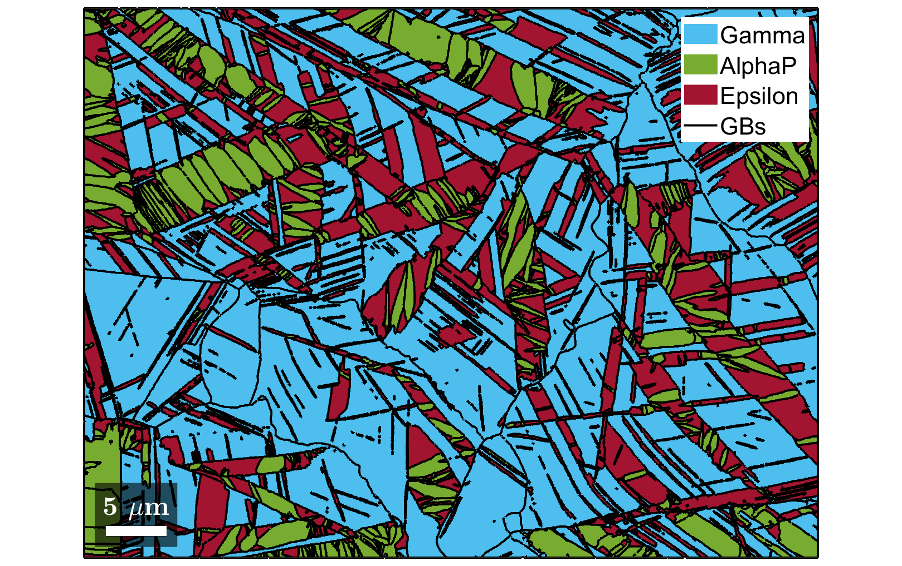

# ***** REPO CURRENTLY UNDER CONSTRUCTION *****

# ORPlotter
**ORPlotter** is a function library for plotting publication-ready figures on analysis of martensitic transformations. The function library is written in **MATLAB** and can be used as an add-on to the basic phase-transition functionalities within the crystallographic **MATLAB** toolbox **MTEX** (found [here](https://mtex-toolbox.github.io/MaParentGrainReconstruction.html)).

MTEX has a vast functionality to analyse phase-transitions. It's major advantage compared to competing programs is its versatility, both in therms of functionality and data compatibility. The current library aims at being an add-on to MTEX for creating stunning and informative plots on martensitic microstructures that are too individual to be included in the main MTEX program. 

While the library mostly consists of plotting functionalities, it also includes some utility functions and advanced analysis capabilities. These are highlighted in an example script **"TBA"** that follows the analysis shown in the [MTEX documentation](https://mtex-toolbox.github.io/MaParentGrainReconstruction.html) and extends it by using the present library.

All functions should be well-documented by comments within the functions. Here is a brief overview of all functions:

### plotMap_phases
- Syntax
  -  p2c = plotMap_phases(job)
- Input
  - job  - @parentGrainReconstructor

The function plots a phase map of the grains within "job" and adds the high-angle boundaries (*job.grains.boundary*) and low-angle boundaries (*jobgrains.innerBoundary*).

  

### renamePhases
- Syntax
  - ebsd = renamePhases(ebsd,phStr)
- Input
  - ebsd             - @EBSD
  - phaseStrings     - cell array of strings with possible phase names

The function opens an interactive list with the possible phasenames in *phaseStrings* and renames the phases in *ebsd* according to the selection.

