# ORTools alphabetical function index

## ORTools alphabetical function index

## C
  
### computeBainGrains

This function computes the Bain group IDs of child grains.

- Syntax
  - [bain_grains] = computeBainGrains(job)
- Input
  - job           - @parentGrainReconstructor
- Output
  - bain_grains   - @grains2d 

### computeGrains

This function is a GUI to compute grains from ebsd map data and optionally filters them.

- Syntax
  - [ebsd,grains,gB] = computeGrains(ebsd)
- Input
  - ebsd  - @EBSD
- Output
  - ebsd     - @EBSD
  - grains   - @grains2d 
  - gB       - @grainBoundary

  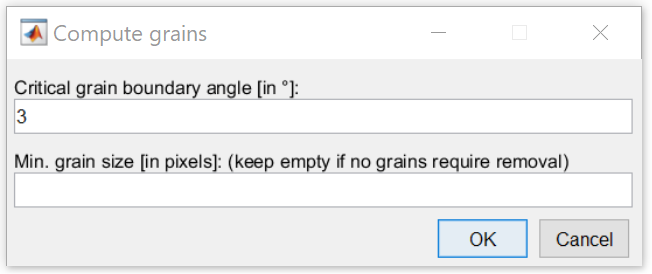

### computeGrainPairs

This function computes the absolute or normalised frequency and boundary segment lengths of grain pairs. 
The grain pair ids can be defined by the user for variants, crystallographic packets, Bain groups, any other-id type or for groups of id or equivalent id pairs.

- Syntax:
  - [out] = computeGrainPairs(grains)

- Input:
  - pairGrains   - @grain2d = child grain pairs as computed by the [computeVariantGrains](function_index.md#computeVariantGrains) function

- Output:
  - out          - @struc   = a strcture variable containing the absolute or normalised frequency and boundary segment lengths of grain pairs. 

- Options:
  - variant    - Uses the variant ids of child grain pairs.
  - packet     - Uses the packet ids of child grain pairs.
  - bain       - Uses the bain ids of child grain pairs.
  - other      - Uses a pre-specified list of ids of child grain pairs.
  - group      - A cell defining different groups of id or equivalent id pairs. Use the [computeVariantPairGroups](function_index.md#computeVariantPairGroups) function to derive the complete set of groups automatically.
  - labels     - A cell of x-axis labels, one per group, used when plotting groups of id or equivalent id pairs. Labels are composed from the id pairs themselves if not specified.
  - include    - Includes similar neighbouring variant, packet, bain, other-id type, groups of id or equivalent id pairs. For e.g. - V1-V1, or CP2-CP2, or B3-B3 etc.  
  - exclude    - Excludes similar neighbouring variant, packet, bain, other-id type, groups of id or equivalent id pairs. (default)
  - absolute   - Returns the absolute frequency and boundary segment values of neighbouring variant, packet, bain, other-id type, or groups of id or equivalent id pairs.
  - normalise  - Returns the normalised frequency and boundary segment values of neighbouring variant, packet, bain, other-id type, groups of id or equivalent id pairs. (default)

### computeHabitPlane

This function computes the habit plane based on the determined traces from 2D ebsd map data as per the following reference:

[**T. Nyyssönen, A.A. Gazder, R. Hielscher, F. Niessen, Habit plane determination from reconstructed parent phase orientation maps. (https://doi.org/10.48550/arXiv.2303.07750)**](https://doi.org/10.48550/arXiv.2303.07750)

- Syntax
  - [hPlane,statistics] = computeHabitPlane(job)
- Input
  -  job            - @parentGrainReconstructor
- Output
  -  hPlane         - @Miller     = Habit plane
  -  statistics     - @Container  = Statistics of fitting
- Options
  -  Radon          - Radon based algorithm (ebsd pixel data used)
  -  Fourier        - Fourier based algorithm (ebsd pixel data used)
  -  Calliper       - Shortest calliper based algorithm (grain data used)
  -  Shape          - Characteristic grain shape based algorithm (grain data used)
  -  Hist           - Circular histogram based algorithm (grain data used)
  -  minClusterSize - Minimum number of pixels required for trace determination (default = 100)
  -  reliability    - Minimum value of accuracy in determined traces used to compute the habit plane (varies from 0 to 1, default = 0.5)
  -  colormap       - Defines the colormap to display the variants (default =  haline)
  -  linecolor      - Defines the linecolor of the plotted traces (default =  red)
  -  noScalebar     - Remove scalebar from maps
  -  noFrame        - Remove frame around maps
  -  plotTraces     - Logical used to plot the trace & habit plane output

  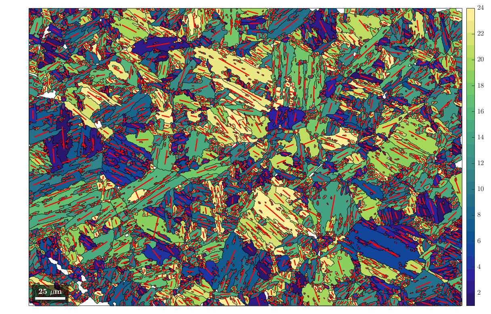

### computePacketGrains

This function computes the crystallographic packet IDs of child grains.

- Syntax
  - [packet_grains] = computePacketGrains(job)
- Input
  - job             - @parentGrainReconstructor
- Output
  - packet_grains   - @grains2d

### computeParentTwins

This function computes twins in parent grains by local refinement.

- Syntax
  -  computeParentTwins(job,pGrainId)
- Input
  -  job          - @parentGrainreconstructor
  -  pGrainId     - parent grain Id 
  -  direction    - @vector3d
- Options
  -  grains       - plot grain data instead of EBSD data

  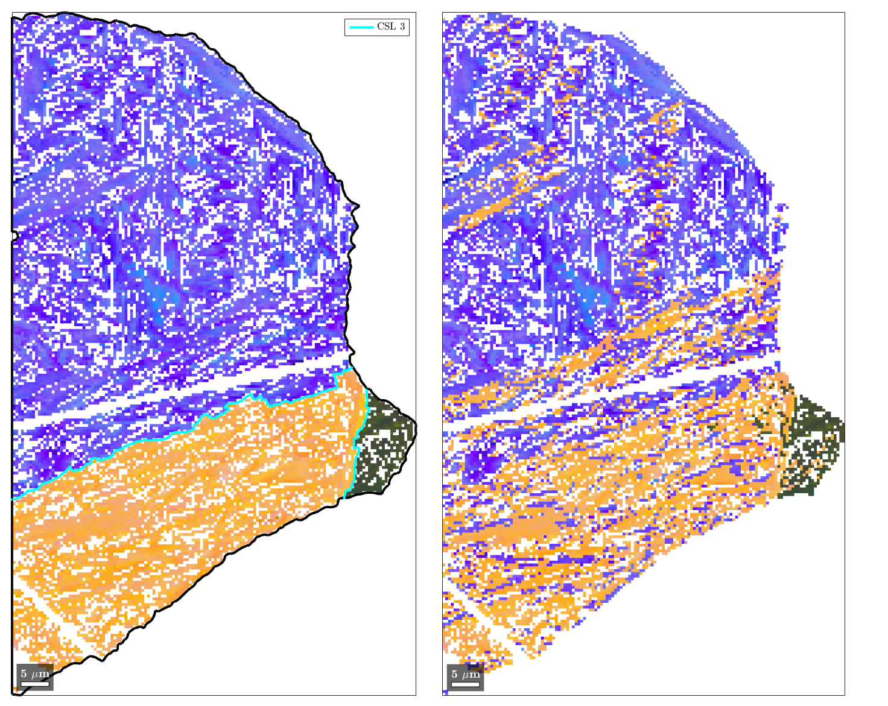

### computeVariantGrains

This function refines the child grains in the *job* object based on their variant IDs. It returns a grain object containing the refined child grains alongside all other grains and an EBSD object with updated grain Ids.

- Syntax
  - [variant_grains,cEBSD] = computeVariantGrains(job,varargin)
- Input
  - job              - @parentGrainReconstructor
- Output
  - grains           - @grains2d 
  - ebsd             - @EBSD
- Options
  - parentGrainId    - parent grain Id using the argument 'parentGrainId'

### computeVariantPairGroups

This function automatically derives the complete list of crystallographic variant pair groups for an orientation relationship.
Two variant pairs belong to the same group when their misorientations are symmetrically equivalent.
For example, for the Kurdjumov-Sachs OR with 24 variants, all nchoosek(24,2) = 276 variant pairs are sorted into 16 groups, each of which is labelled by its V1-Vx representative(s).
The output is intended to be passed straight to the *group* option of the [computeGrainPairs](function_index.md#computeGrainPairs) function.
Doing so counts every variant pair boundary in the map, whereas a manually defined grouping that only lists pairs containing V1 (for e.g. `{[1 2],[1 3; 1 5],...}`) discards the ~92% of boundaries in which V1 is not literally one of the two variants.

- Syntax
  - [groupIds,groupLabels] = computeVariantPairGroups(job)
  - [groupIds,groupLabels] = computeVariantPairGroups(p2c,'variantMap',vMap)
- Input
  - job            - @parentGrainReconstructor, or the parent-to-child @orientation relationship (p2c) directly.
- Output
  - groupIds       - @cell = a cell array of groups. Each cell holds an n x 2 array of variant id pairs whose misorientations are symmetrically equivalent.
  - groupLabels    - @cell = a cell array of labels, one per group, named after the V1-Vx representative(s) of the group (for e.g. 'V1-V2', 'V1-V3(V5)').
- Options
  - threshold      - The angular tolerance used to decide whether two misorientations are equivalent. (default = 0.5*degree)
  - variantMap     - The variant map to apply. Only used when the first input is a p2c @orientation; a @parentGrainReconstructor supplies its own *job.variantMap*.

## D

### defineORs

This auxiliary function defines an orientation relationship (OR) for a parent-child phase combination given in the *job* object as:
- Parallel planes and directions in a GUI, or 
- Peakfitting of the parent-child boundary misorientation angle distribution.

- Syntax
  - job = defineORs(job)
- Input
  - job  - @parentGrainReconstructor
- Output
  - job  - @parentGrainReconstructor

## F

### fibreMaker

This function creates an ideal crystallographic fibre with a user specified half-width and exports the data as:
- a lossless Mtex *.txt* file for MTEX v5.9.0 and onwards), or 
- a lossy discretised Mtex *.txt* file for MTEX up to v5.8.2) for later use.

- Syntax
  -  fibreMaker(crystalDirection,specimenDirection)
- Input
  - crystalDirection  - @Miller
  -  sampleDirection  - @vector3d
  -  sampleSymmetry   - @specimenSymmetry
- Options
  - halfwidth         - halfwidth for the ODF calculation
  - export            - (optional path and) name of the file

## G

### grainClick

This function produces a figure of an interactive ebsd map. It enables users to click on individual parent grains for detailed variant analysis.

- Syntax
  - grainClick(job)
- Input
  - job          - @parentGrainReconstructor
  - direction    - @vector3d 
- Options
  - parentTwins  - Refine grains to detect parent twins
  - grains       - Plot grain data instead of EBSD data 
  - noScalebar   - Remove scalebar from maps
  - noFrame      - Remove frame around maps

  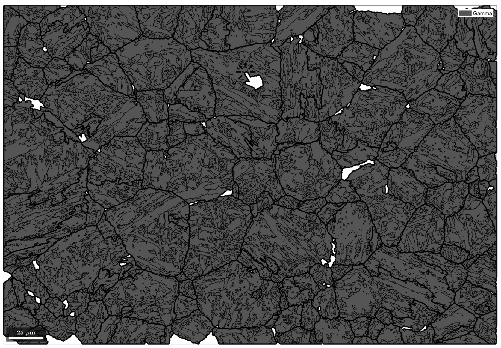

### guiOR

This function is a GUI to to define an orientation relationship (OR) with parallel planes and directions.

- Syntax
  - p2c = guiOR(job)
- Input
  - job  - @parentGrainReconstructor
- Output
  - p2c  - parent to child misorientation

  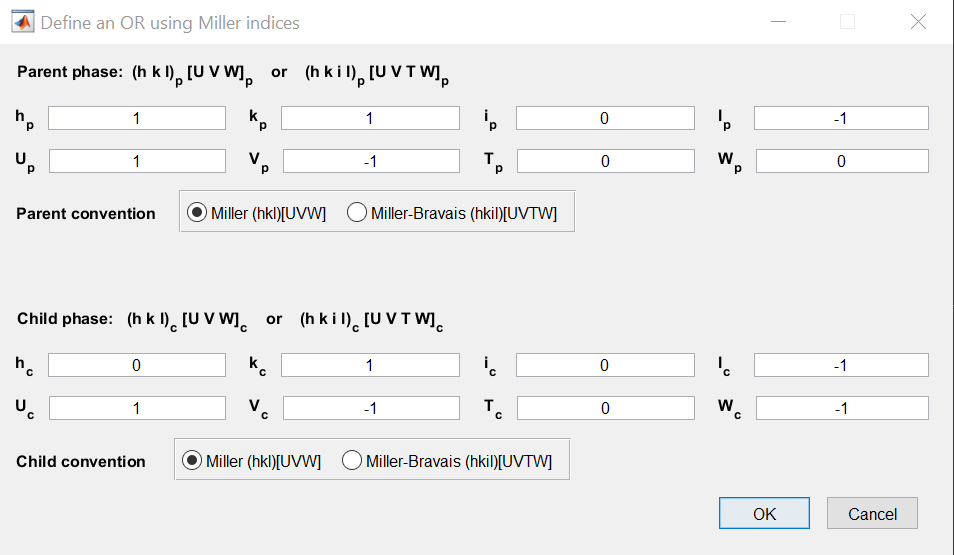

## O

### orientationMaker

This function creates an ideal crystallographic orientation from a unimodal ODF with a user specified half-width and exports the data as a lossless Mtex *.txt* file for later use.

- Syntax
  -  orientationMaker(ori)
- Input
  - ori              - @orientation
  -  sampleSymmetry  - @specimenSymmetry
- Options
  - halfwidth        - halfwidth for the odf calculation 
  - export           - (optional path and) name of the file

### ORInfo

The function extracts orientation relationship (OR) information contained in the *job.p2c* structure variable and outputs it in the MATLAB command window.

- Syntax
  -  ORinfo(p2c)
- Input
  - p2c       - parent to child misorientation
- Output
  - OR        - structure containing OR information
- Options
  - silent    - suppress command window output

  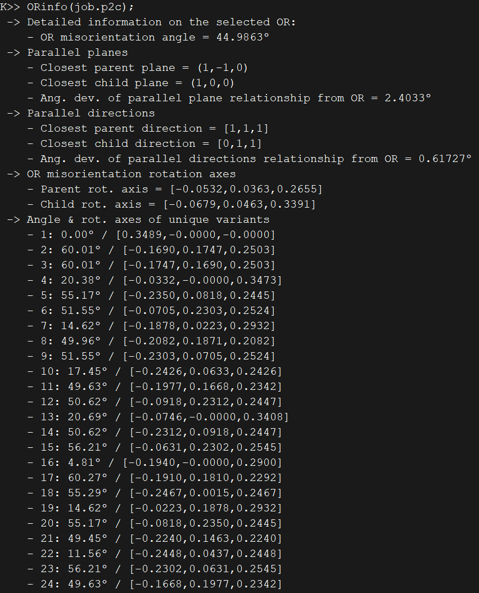

## P

### peakFitORs

This function peak fits parent-child misorientation angle ranges to determine one or several orientation relationships (ORs).
The function is called by [defineORs](function_index.md#defineORs).

- Syntax
  -  p2c = peakFitORs(job,misoRange)
- Input
  - job         - @parentGrainReconstructor
  - misoRange   - range of misorientation angles in which to fit
- Output
  - p2c         - parent to child misorientation

  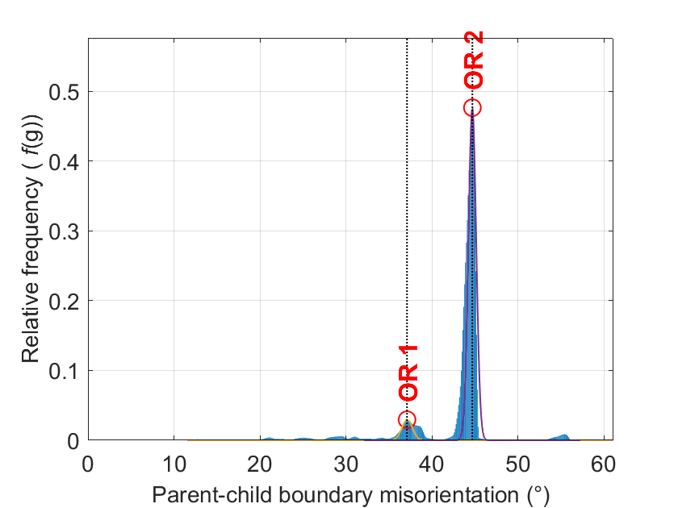

### plotHist_OR_misfit

This function plots the disorientation, (or misfit), between parent-child and child-child grains and an orientation relationship (OR) in a histogram. By default, the current OR (*job.p2c*) is selected and is denoted by 2 stars (**). Additional ORs can be supplied with the argument *p2c*.

- Syntax
  -  plotHist_OR_misfit(job)
  -  plotHist_OR_misfit(job,p2c)
- Input
  - job     - @parentGrainReconstructor
  - p2c     - one or multiple additional orientation relationship(s) to evaluate
- Options
  - bins    - number of histogram bins
  - legend  - cell array of strings with legend names of ORs to evaluate

  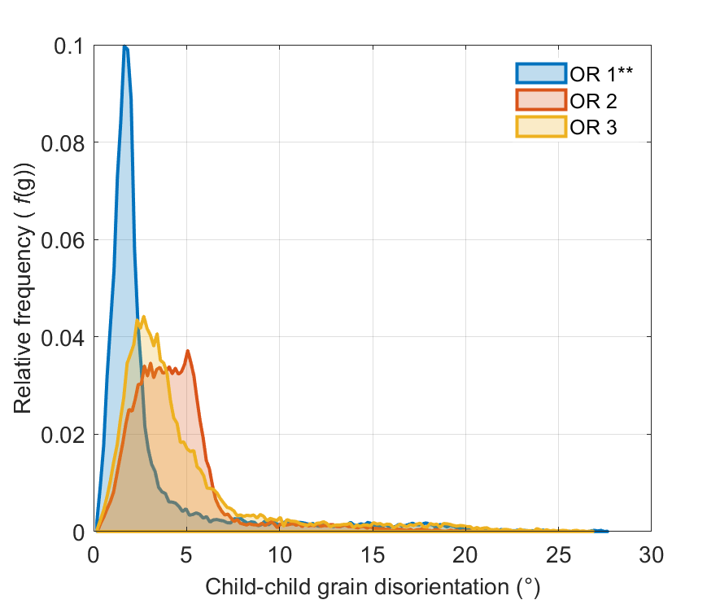

### plotIPDF_gB_misfit

This function plots the misfit, or disorientation, between parent-child and child-child boundaries sharing an orientation relationship (OR) in an inverse pole figure (IPF) showing the misorientation axes.

- Syntax
  -  plotIPDF_gB_misfit(job)
- Input
  - job       - @parentGrainReconstructor
- Options
  - colormapP - colormap variable for parent grains
  - colormapC - colormap variable for child grains
  - maxColor  - maximum color on color range [degree]

  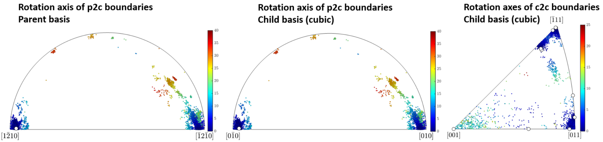

### plotIPDF_gB_prob

This function calculates and plots the probability distribution, between 0 and 1, that a boundary belongs to an orientation relationship (OR) in an inverse pole figure (IPF) showing the misorientation axes.

- Syntax
  -  plotIPDF_gB_prob(job)
- Input
  - job       - @parentGrainReconstructor
- Options
  - colormap  - colormap variable  

  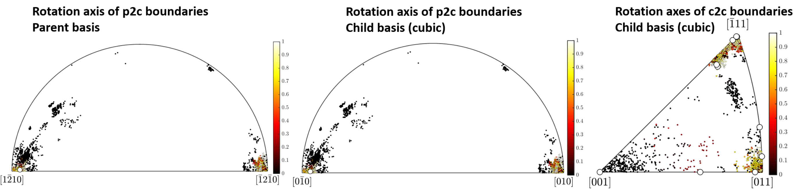

### plotMap_bain

This function plots an ebsd map by colorising child grains according to their Bain group ID. It also outputs the area fraction of each Bain group.

- Syntax
  -  plotMap_bain(job)
- Input
  -  job          - @parentGrainreconstructor
- Output
  -  f_area: Area fraction of each Bain group in the EBSD map
- Options
  -  colormap     - colormap variable
  -  grains       - plot grain data instead of EBSD data

  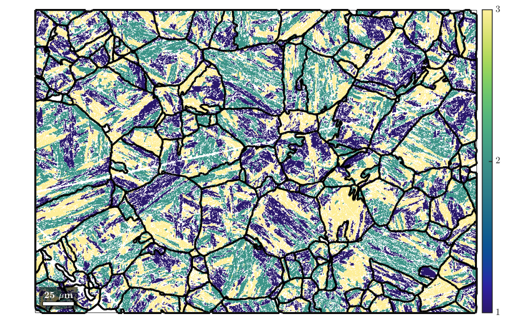

### plotMap_blockWidths

This function calculates and plots an ebsd map of the representative value for martensite block widths by projecting all boundary points to the vector perpendicular to the trace of the {111}a plane as per the following reference:

[**S.Morito, H.Yoshida, T.Maki, X.Huang, Effect of block size on the strength of lath martensite in low carbon steels, Mater. Sci. Eng.: A, Volumes 438–440, 2006, Pages 237-240. (https://doi.org/10.1016/j.msea.2005.12.048)**](https://doi.org/10.1016/j.msea.2005.12.048)

Contributed by *Dr. Tuomo Nyyssönen*

- Syntax
  - plotMap_blockWidths(job,varargin)
- Input
  - job          - @parentGrainreconstructor
  - pGrainId     - parent grain Id using the argument 'parentGrainId'
- Options
  - noScalebar   - Remove scalebar from maps
  - noFrame      - Remove frame around maps

  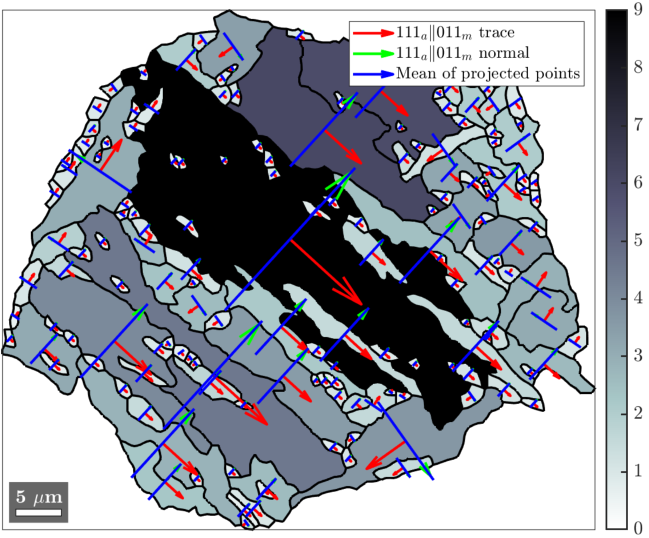

### plotMap_clusters

This function plots an ebsd map of child grain clusters that are likely to belong to the same parent grain when [clusterGraph](https://mtex-toolbox.github.io/parentGrainReconstructor.clusterGraph.html) is called. It is displayed as an overlay on top of a semi-transparent IPF map of child grains.

- Syntax
  -  ipfKey = plotMap_clusters(job)
  -  ipfKey = plotMap_clusters(job,direction)
- Input
  - job        - @parentGrainReconstructor
  - direction  - @vector3d - IPF direction

  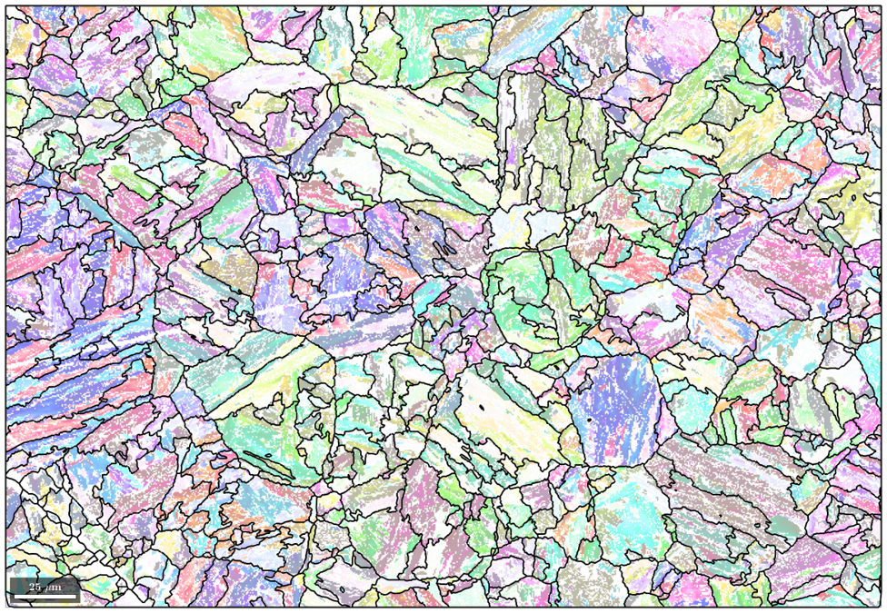

### plotMap_gB_c2c

This function plots an ebsd map by colorising child-child boundary misorientations contained in the variable *job*.

- Syntax
  -  plotMap_gB_c2c(job)
- Input
  - job  - @parentGrainReconstructor
- Options
  - colormap  - colormap variable 

  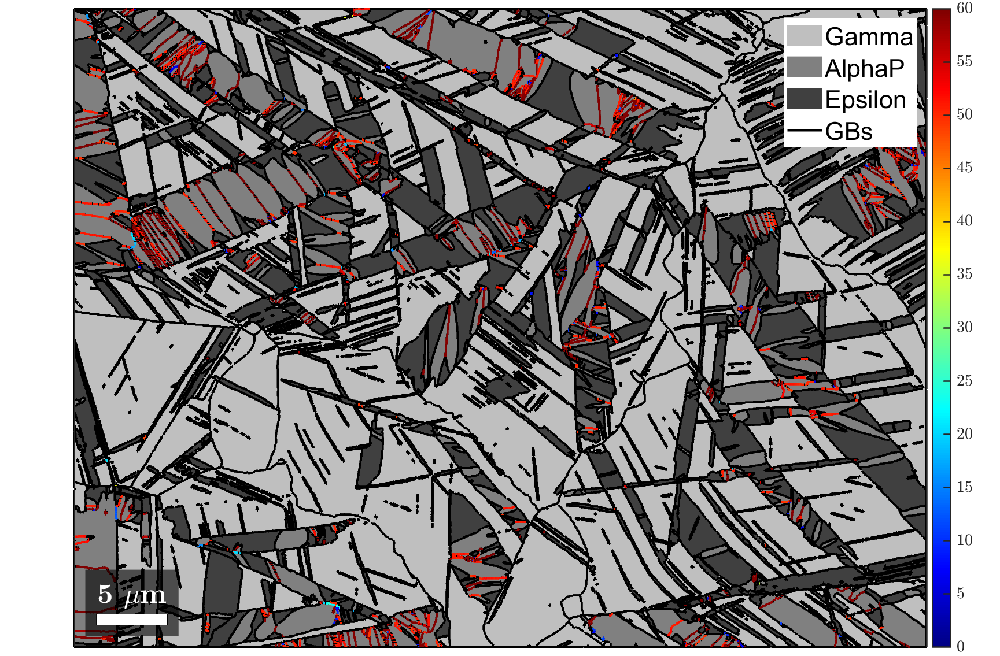

### plotMap_gB_misfit

This function plots an ebsd map by colorising the misfit, or disorientation, between parent-child and child-child boundaries with the orientation relationship (OR) *job.p2c*

- Syntax
  - plotMap_gB_misfit(job)
- Input
  - job       - @parentGrainReconstructor
- Options
  - colormap  - colormap variable 

  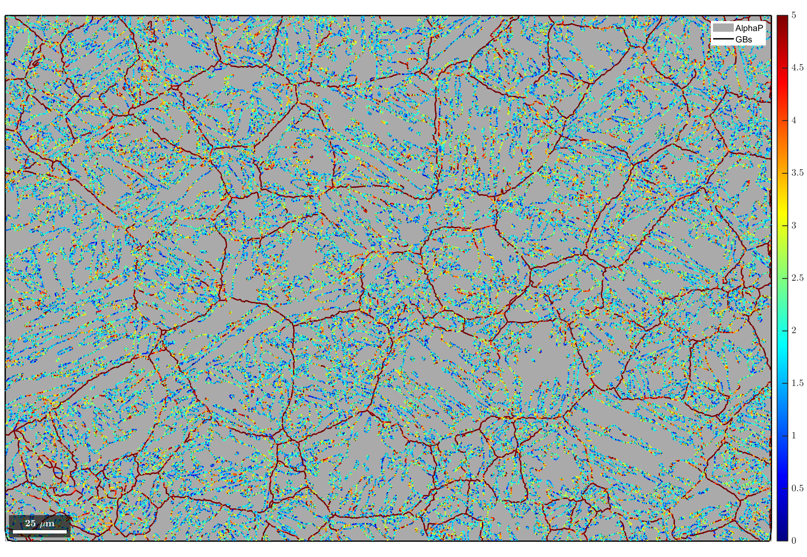

### plotMap_gB_p2c

This function plots an ebsd map by colorising child-child boundary misorientations contained in the variable *job*.

- Syntax
  -  plotMap_gB_p2c(job)
- Input
  - job       - @parentGrainReconstructor
- Options
  - colormap  - colormap variable 
 

  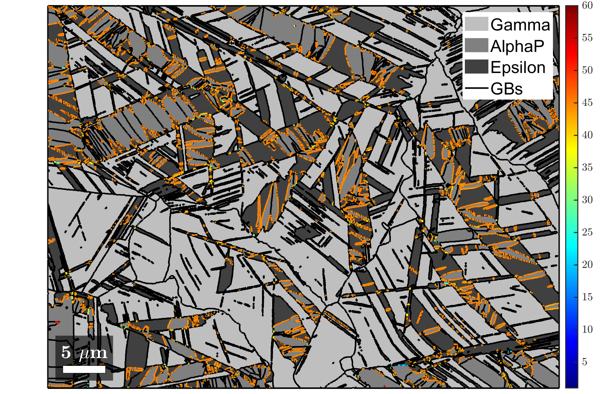

### plotMap_gB_prob

This function calculates and plots an ebsd map of the probability distribution, between 0 and 1, that a boundary belongs to an orientation relationship (OR). 
For more details, [please click here.](https://mtex-toolbox.github.io/parentGrainReconstructor.calcGraph.html)

- Syntax
  -  plotMap_gB_prob(job)
- Input
  - job       - @parentGrainReconstructor
- Options
  - threshold - the misfit at which the probability is exactly 50 percent ... 
  - tolerance - ... and the standard deviation in a cumulative Gaussian distribution
  - colormap  - colormap variable 
 

  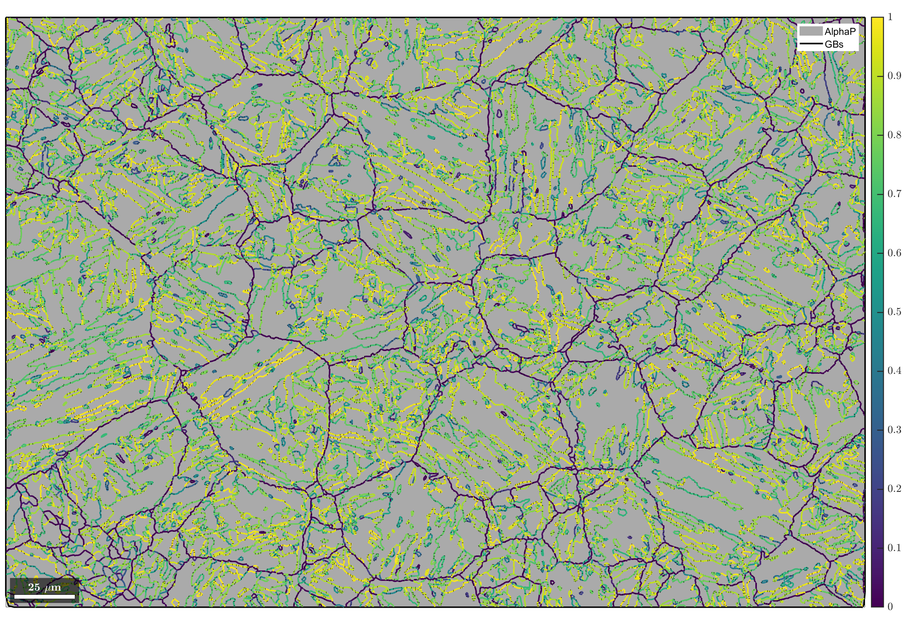

### plotMap_IPF_p2c

This function plots inverse pole figure maps of the parent and child phases and returns the ipfHSV color key.

- Syntax
  -  plotMap_IPF_p2c(job)
  -  plotMap_IPF_p2c(job, direction)
- Input
  - job       - @parentGrainReconstructor
  - direction - @vector3d 
- Output
  - ipfKey    - @ipfHSVKey 
- Options
  - parent    - plot only map of parent phase
  - child     - plot only map of child phase 

  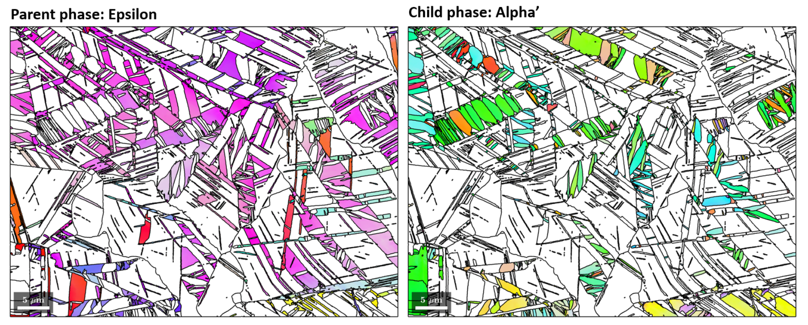

### plotMap_packets

This function plots an ebsd map by colorising child grains according to their crystallographic packet ID. It also outputs the area fraction of each crystallographic packet.

- Syntax
  -  plotMap_packets(job)
- Input
  - job      - @parentGrainReconstructor
- Options
  - colormap - colormap variable
  - grains   - Plot grain data instead of EBSD data 

  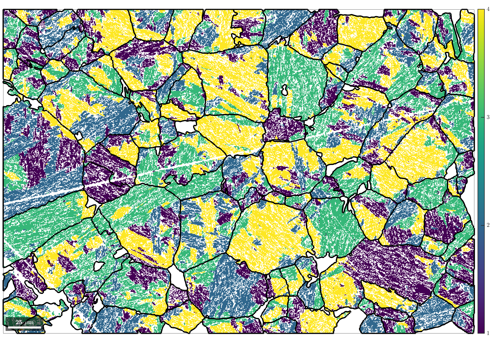

### plotMap_phases

This function plots an ebsd map of the grain phases in the *job* variable as well as the grain boundaries (*job.grains.boundary*).

- Syntax
  -  p2c = plotMap_phases(job)
- Input
  - job  - @parentGrainReconstructor

  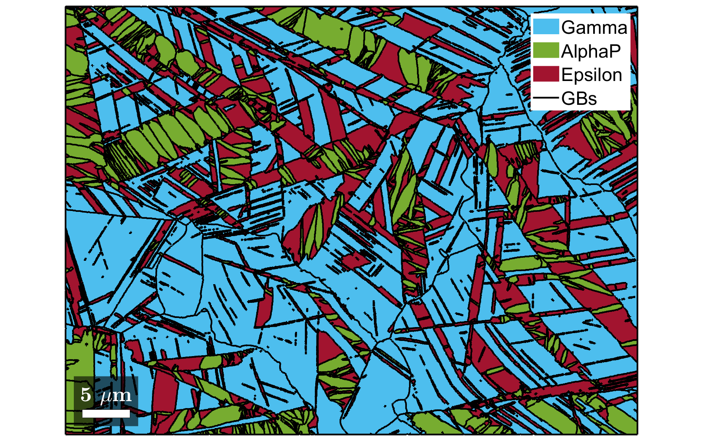

### plotMap_KSvariantPairs

This function plots an ebsd map of the equivalent pairs of martensitic variants (block boundaries) within individual crystallographic packets in lath martensite microstructures as per the analysis in the following reference:

[**S. Morito, A.H. Pham, T. Hayashi, T. Ohba, Block boundary analyses to identify martensite and bainite, Mater. Today Proc., Volume 2, Supplement 3, 2015, Pages S913-S916. (https://doi.org/10.1016/j.matpr.2015.07.430)**](https://doi.org/10.1016/j.matpr.2015.07.430)

- Syntax
  - variantPairs_boundary = plotMap_KSvariantPairs(job,varargin)
- Input
  - job          - @parentGrainreconstructor
  - pGrainId     - parent grain Id using the argument 'parentGrainId'
- Output
  - variantPairs_boundary - a structure variable of the groups of equivalent variant pair boundaries
- Options
  -  include     - Includes equivalent variant pairs between crystallographic packets
  - noScalebar   - Remove scalebar from maps
  - noFrame      - Remove frame around maps

  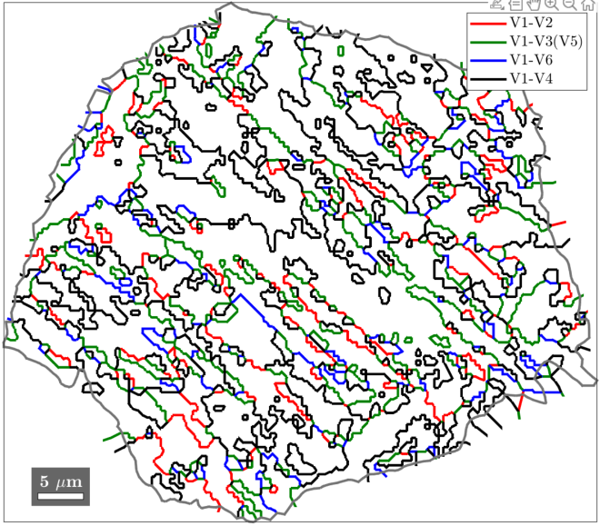

### plotMap_variants

This function plots an ebsd map by colorising child grains according to their variant IDs. It also outputs the area fraction of each variant.

The function plots the map of child grains colored according to their variant ID.

- Syntax
  -  plotMap_variants(job)
- Input
  - job  - @parentGrainReconstructor
- Options
  - colormap - colormap variable
  - grains   - Plot grain data instead of EBSD data 

  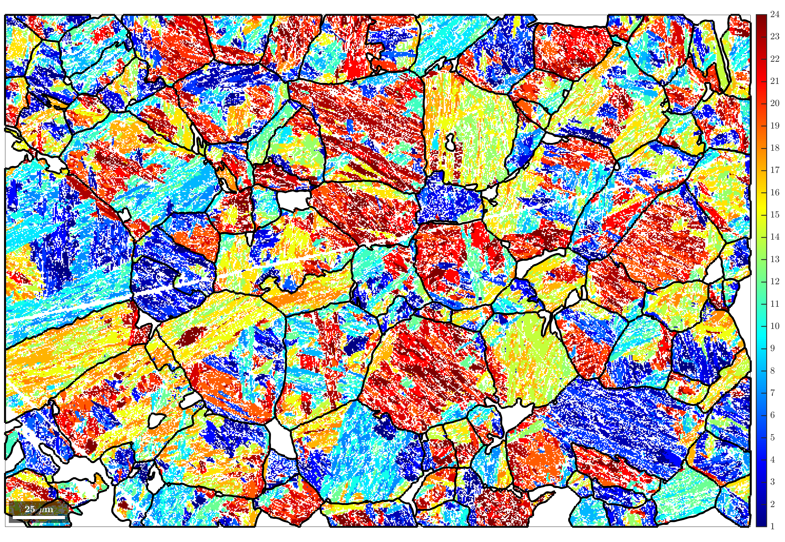

### plotPDF_bain

This function plots a pole figure of the child Bain group IDs associated with an OR *job.p2c*.

- Syntax
  -  plotPDF_bain(job)
  -  plotPDF_bain(job,oriParent)
  -  plotPDF_bain(job,oriParent,pdf)
- Input
  -  job          - @parentGrainreconstructor
  -  oriParent    - @orientation
  -  pdf          - @Miller
- Options
  -  colormap     - colormap variable

  

### plotPDF_packets

This function plots a pole figure of the child crystallographic packet IDs associated with an OR *job.p2c*.

- Syntax
  -  plotPDF_packets(job)
  -  plotPDF_packets(job, oriParent)
  -  plotPDF_packets(job, oriParent, pdf)
- Input
  - job       - @parentGrainReconstructor
  - oriParent - @orientation
  - pdf       - @Miller
- Options
  - colormap   - colormap variable 
  - markersize - markersize 

  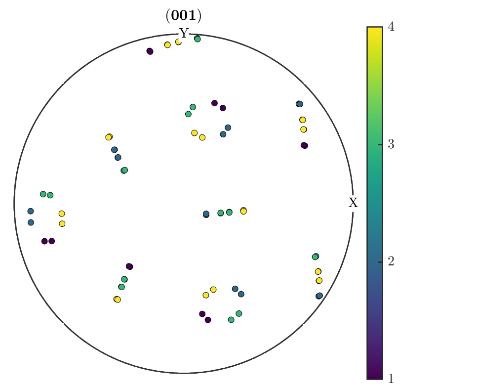

### plotPDF_variants

This function plots a pole figure of the child variant IDs associated with an OR *job.p2c*. 
It is an alternative to MTEX's default [plotVariantPF](https://mtex-toolbox.github.io/parentGrainReconstructor.plotVariantPF.html).

- Syntax
  -  plotPDF_variants(job)
  -  plotPDF_variants(job, oriParent)
  -  plotPDF_variants(job, oriParent, pdf)
- Input
  - job       - @parentGrainReconstructor
  - oriParent - @orientation
  - pdf       - @Miller
- Options
  - colormap   - colormap variable 
  - markersize - markersize 

  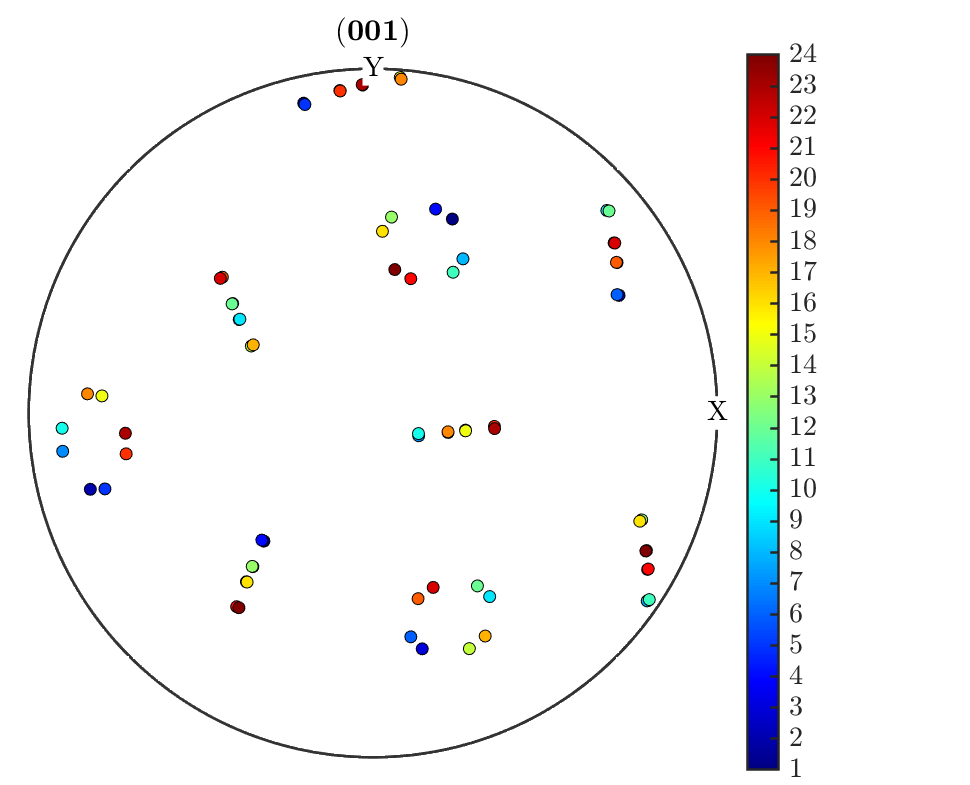

### plotPODF_transform

The function calculates and plots the transformation texture, with or without imposing variant selection, based on a parent texture file.
Input files can be created using:
 - ebsd map data [as shown in example 4](examples.md), 
 - [fibreMaker](function_index.md#fibreMaker), or
 - [orientationMaker](function_index.md#orientationMaker).

- Syntax
  -  plotPODF_transformation(job,hParent,hChild)
- Input
  - hParent      - @Miller  (parent pole figures to display)
  - hChild       - @Miller  (child pole figures to display)
- Options
  - odfSecP      - array with angles of parent ODF section to display
  - odfSecC      - array with angles of child ODF section to display
  - colormapP    - colormap variable for parent PFs and ODFs
  - colormapC    - colormap variable for child PFs and ODFs
  - variantId    - list of specific variant Ids to plot
  - variantWt    - list of specific variant weights to plot
  - halfwidth    - halfwidth for PF calculation & display
  - import       - (optional path) & name of the input *.mat file to transform
  - export       - (optional path) & name of the output transformed *.mat file

  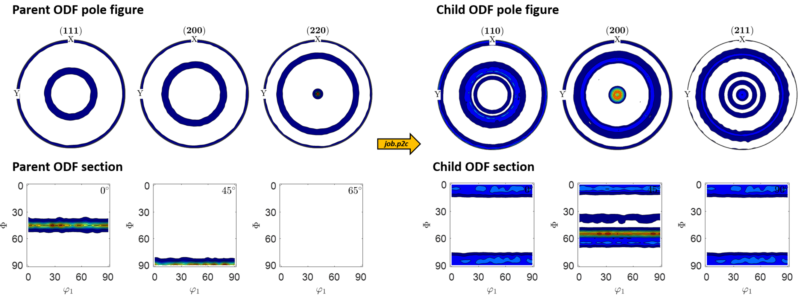

### plotStack

This function plots a series of maps, figures, graphs, and tables for detailed child variant analysis within a single parent grain as follows: 
- By manually supplying a *parentGrainId*, or 
- Using the [grainClick](function_index.md#grainClick) function and interactively choosing a grain of interest.

- Syntax
  -  plotStack(job,pGrainId)
- Input
  - job          - @parentGrainreconstructor
  - pGrainId     - parent grain Id
  - direction    - @vector3d 
- Options
  - grains       - Plot grain data instead of EBSD data 
  - noScalebar   - Remove scalebar from maps
  - noFrame      - Remove frame around maps

  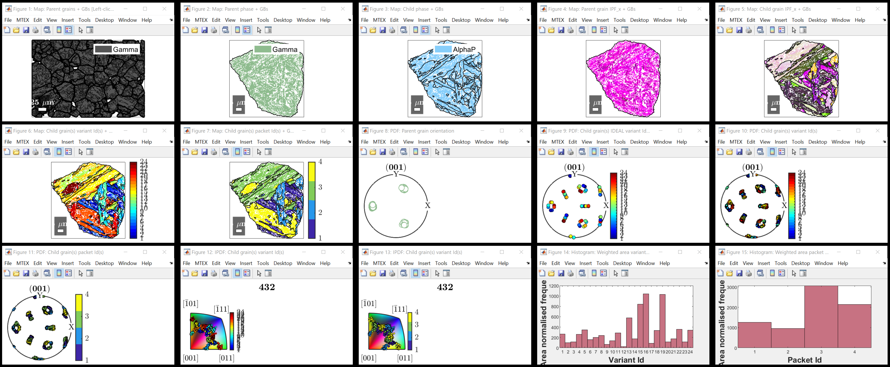

## R

### readCPR

This function is a GUI to interactively load *.cpr* and *.crc* ebsd map data files into MTEX.

- Syntax
  - ebsd = readCPR
  - ebsd = readCPR(inPath)
  - ebsd = readCPR(inPath, fileName)
- Input
  - inPath   - string with path to directory 'xx\yy\zz\'
  - fileName - string with filename 'xxyyzz.cpr'
- Output
  - ebsd     - @EBSD

### recolorPhases

This function is a GUI to interactively recolor phases in the *ebsd* or *grains* variables.

- Syntax
  - [ebsd] = recolorPhases(ebsd)
  - [grains] = recolorPhases(grains)
- Input
  - ebsd    - @EBSD
  - grains  - @grains2d
- Output
  - ebsd    - @EBSD
  - grains  - @grains2d
  

  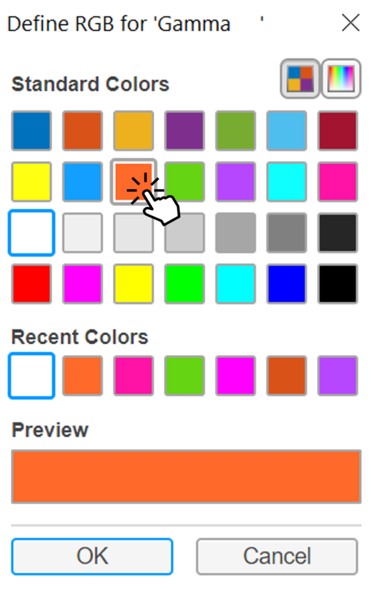

### renamePhases

This function is a GUI to interactively rename phases. 
It opens a list of phase names (pre-defined in *phaseStrings*) and renames each phase in the *ebsd* variable according to a user's selection.

- Syntax
  - ebsd = renamePhases(ebsd,phStr)
- Input
  - ebsd         - @EBSD
  - phaseStrings - cell array of strings with possible phase names
- Output
  - ebsd         - @EBSD

## S

### saveImage

This function saves all open figures as images.

- Syntax
  - saveImage(fileDir,fileName)
  - saveImage(fileDir)
  - saveImage
- Input
  - fileName    - file name (string with file of type * .bmp, * .jpeg, * .png or * .tiff )
  - fileDir     - file directory

### screenPrint

This function formats command window output.

- Syntax
  - screenPrint(mode)
  - screenPrint(mode, string)
- Input
  - mode     - formatting mode
  - string   - output string

### setInterp2Latex

This function changes all MATLAB text interpreters from 'tex' to 'latex in all subsequent figures, plots, and graphs.

- Syntax
  - setInterp2Latex

### setInterp2Tex

This function changes all MATLAB text interpreters from 'latex' to 'tex in all subsequent figures, plots, and graphs.

- Syntax
  - setInterp2Tex

### setParentGrainReconstructor

This function is a GUI to define a job of class [parentGrainReconstructor](https://mtex-toolbox.github.io/parentGrainReconstructor.parentGrainReconstructor.html).

- Syntax
  - setParentGrainReconstructor(ebsd,grains)
  - setParentGrainReconstructor(ebsd,grains,inPath)
- Input
  - ebsd     - @EBSD
  - grains   - @grain2d
  - inPath   - string giving path to * .cif file folder 
- Output
  - job      - @parentGrainReconstructor

## T

### tileFigures

This function tiles all figures evenly across the computer screen/monitor.

- Syntax
  - fileFigs

